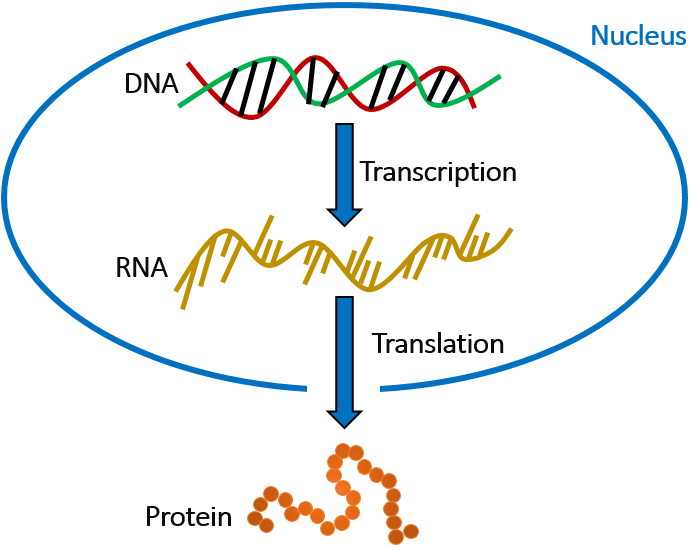
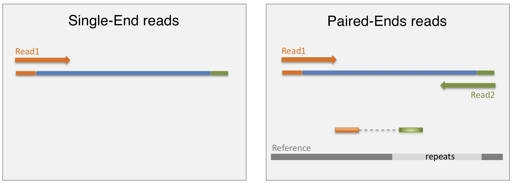

##  {#TitleSlide data-menu-title="TitleSlide" background-image="images/back001.jpg" background-size="cover" background-opacity="0.3"}

```{r setup, include=FALSE}
library(fontawesome)
library(tidyverse)
library(quarto)
```

::: {style="position: absolute; left: 180px; top: 200px; height: 525px; width: 1500px; background-color: #69b1e9; padding: 20px; padding-left: 50px; border-radius: 5px;"}
[Basi di RNA-Seq]{style="font-size: 100px; font-weight: bold; line-height: 1em; margin: 0px;"}

[Dalla Biologia al Dato Grezzo]{style="font-size: 40px;font-weight: bold;"}

<br> <br>

[Analisi Bulk RNA-Seq per Dottorandi]{style="font-size: 40px; font-weight: bold;"}
:::

#  {background-image="images/back001.jpg" background-size="cover" background-opacity="0.1"}

[Perché Studiare l'RNA?]{.tit .p-span-center}

##  {background-image="images/back001.jpg" background-size="cover" background-opacity="0.1"}

[Il Dogma Centrale]{.subtit}

::: {.p-img-center}

:::

:::{.tcenter .f30}
*   **DNA:** Il progetto statico dell'informazione genetica.
*   **RNA:** Il messaggero dinamico e funzionale.
*   **Proteina:** L'esecutore finale (spesso).
:::

##  {background-image="images/back001.jpg" background-size="cover" background-opacity="0.1"}

[La Potenza dell'RNA-Seq]{.subtit}

:::: {.columns}
::: {.column width="50%" .f30}
*   **Snapshot Dinamico:**
    *   L'RNA riflette lo stato della cellula in un preciso momento (trattamento vs controllo).
*   **Non solo espressione:**
    *   Splicing alternativo (isoforme).
    *   Fusioni geniche.
    *   Mutazioni (SNPs).
    *   RNA non codificanti (lncRNA, miRNA).
:::
::: {.column width="50%" .f30}
*   **Rispetto al DNA:**
    *   Ci dice *cosa* sta succedendo, non solo cosa *potrebbe* succedere.
*   **Rispetto ai Microarray:**
    *   Non limitato ai geni noti (scoperta *de novo*).
    *   Range dinamico più ampio (rileva sia geni molto espressi che rari).
:::
::::

#  {background-image="images/back001.jpg" background-size="cover" background-opacity="0.1"}

[Design Sperimentale]{.tit .p-span-center}

##  {background-image="images/stat001.jpg" background-size="cover" background-opacity="0.1"}

[Repliche Tecniche?]{.tit .p-span-center}

::: {.fragment .f100 .tcenter .rn}
NO
:::

::: {.callout-important}
Con le attuali tecnologie NGS, la variazione tecnica è molto inferiore alla variazione biologica. Le repliche tecniche (stesso RNA sequenziato due volte) sono inutili.
:::

##  {background-image="images/stat001.jpg" background-size="cover" background-opacity="0.1"}

[Repliche Biologiche?]{.tit .p-span-center}

::: {.fragment .f100 .tcenter .rn}
SÌ
:::

::: {.callout-important}
Per l'analisi differenziale, le repliche biologiche sono **essenziali**. Più repliche = stima migliore della varianza biologica = p-value più affidabili. (Minimo assoluto: 3 per gruppo).
:::

##  {background-image="images/back001.jpg" background-size="cover" background-opacity="0.1"}

[Single-End vs Paired-End]{.subtit}

:::{.p-img-center}
{width=800}
:::

::: {.columns .f30}
::: {.column width="50%"}
**Single-End (SE):**
- Una lettura per frammento.
- Più economico.
- OK per: Quantificazione genica semplice.
:::
::: {.column width="50%"}
**Paired-End (PE):**
- Due letture per frammento (dai due lati).
- Meglio per: Mappaggio in regioni ripetute, Splicing, Varianti.
:::
:::

::: {.callout-note}
In `nf-core/rnaseq`, se i dati sono PE, avrai due file FASTQ (`_R1` e `_R2`) per campione nel samplesheet.
:::

##  {background-image="images/back001.jpg" background-size="cover" background-opacity="0.1"}

[Profondità di Sequenziamento]{.subtit}

Quante reads ("milioni") servono?

-   **Solo Espressione Genica:** 10-20 Milioni di reads.
-   **Espressione + Isoforme:** 30-50 Milioni di reads.
-   **Scoperta di trascritti rari:** >50 Milioni.

::: {.fragment}
*Non serve sequenziare all'infinito! Dopo un certo punto, si vedono solo più errori o rumore.*
:::

#  {background-image="images/back001.jpg" background-size="cover" background-opacity="0.1"}

[Tecnologia NGS in Breve]{.tit .p-span-center}

##  {background-image="images/back001.jpg" background-size="cover" background-opacity="0.1"}

[Illumina: Sequencing by Synthesis]{.subtit}

1.  **Libreria:** Frammentazione RNA -> cDNA -> Adattatori.
2.  **Cluster Generation:** Amplificazione clonale sulla flowcell.
3.  **Sequenziamento:** Nucleotidi fluorescenti incorporati uno alla volta.
4.  **Immagini:** Una foto per ogni ciclo -> conversione in basi (A, C, T, G).



##  {background-image="images/back001.jpg" background-size="cover" background-opacity="0.1"}

[Il Risultato: File FASTQ]{.subtit}

È il punto di partenza per la nostra pipeline bioinformatica.

```text
@SEQ_ID
GATTTGGGGTTCAAAGCAGTATCGATCAAATAGTAAATCCATTTGTTCAACTCACAGTTT
+
!''*((((***+))%%%++)(%%%%).1***-+*''))**55CCF>>>>>>CCCCCCC65
```

1.  **Header (`@`)**: ID univoco della read.
2.  **Sequenza**: Basi nucleotidiche.
3.  **Separatore (`+`)**.
4.  **Qualità**: Punteggio (ASCII) che indica la probabilità che la base sia corretta (Phred Score).

#  {background-image="images/qmark.jpg" background-size="cover" background-opacity="0.7"}

::: {style="position: absolute; left: 980px; top: 450px;"}
[Domande?]{style="font-size: 130px; font-weight: bold; color: white"}
:::

