##  {#TitleSlide data-menu-title="TitleSlide" background-image="images/back001.jpg" background-size="cover" background-opacity="0.3"}

```{r setup, include=FALSE}
library(fontawesome)
library(tidyverse)
library(quarto)

# font-family: 'Architects Daughter', cursive;
# font-family: 'Julius Sans One', sans-serif;
# font-family: 'Montserrat', san  s-serif;
# font-family: 'Rock Salt', cursive;
```

<style>
  @import url('https://fonts.googleapis.com/css2?family=Architects+Daughter&family=Julius+Sans+One&family=Montserrat:wght@300&family=Rock+Salt&display=swap');
</style>

::: {style="position: absolute; left: 180px; top: 200px; height: 525px; width: 1500px; background-color: #69b1e9; padding: 20px; padding-left: 50px; border-radius: 5px;"}
[Introduzione all'RNASeq]{style="font-size: 120px; font-weight: bold; line-height: 1em; margin: 0px; font-family: 'Architects Daughter', cursive;"}

[Introduzione all'analisi RNASeq in R]{style="font-size: 40px;font-weight: bold;"}

[Dipartimento di Biomedicina e Prevenzione]{style="font-size: 40px;font-weight: bold;"}

<br> <br>

[Marco Chiapello, Revelo Datalab]{style="font-size: 40px; font-weight: bold;"}

[November 2024]{style="font-size: 30px;font-weight: bold;"}
:::

::::{.notes}
::: {style="font-size: 9pt"}
**Obiettivo:** Presentare il docente e introdurre il corso di analisi bulk RNA-seq in R.

- Presentarsi: Marco Chiapello, Revelo Datalab
- Tema del corso: dall'RNA grezzo ai risultati biologici interpretabili
- Struttura: preparazione campione → sequenziamento → analisi bioinformatica → statistica in R
- Invitare i partecipanti a fare domande in qualsiasi momento
:::
::::


<!-- #  {background-image="images/back001.jpg" background-size="cover" background-opacity="0.1"}

[Overview]{.f60 .p-span-center}

:::{.p-img-center}
{width=1000}
::: -->

#  {background-image="images/back001.jpg" background-size="cover" background-opacity="0.1"}

[Three Stages of Transcriptomic Analysis]{.f60}

<br>

::: {.columns .f35}
::: {.column width="30%" .pri}
*   **Primary Analysis:**
    *   Focuses on processing raw sequencing data.
    *   **Key steps:**
        *   Quality control (QC)
        *   Read alignment/mapping
        *   Transcript quantification
:::
::: {.column width="3%" .verticalLine}

:::

::: {.column width="30%" .sec}
*   **Secondary Analysis:**
    *   Extracts meaningful information from processed data.
    *   **Key steps:**
        *   Differential gene expression analysis
        *   Clustering and classification

:::
::: {.column width="3%"}

:::
::: {.column width="30%" .ter}
*   **Tertiary Analysis:**
    *   Integrates transcriptomic data with other biological knowledge.
    *   **Key steps:**
        *   Pathway and network analysis
        *   Validation of findings
        *   Hypothesis generation and further experimentation
:::
:::

::::{.notes}
::: {style="font-size: 9pt"}
**Obiettivo:** Dare una visione d'insieme del workflow completo dell'analisi trascrittomica.

- Analisi **primaria**: dati grezzi → QC, allineamento, quantificazione (computazione intensiva)
- Analisi **secondaria**: espressione differenziale, clustering (statistiche, R) ← focus del corso
- Analisi **terziaria**: pathway analysis, integrazione con altri dati omici, validazione
- Sottolineare che ogni fase si appoggia alla precedente: errori iniziali si propagano
:::
::::


#  {background-image="images/back001.jpg" background-size="cover" background-opacity="0.1"}


[Sample Preparation]{.tit .p-span-center}

::::{.notes}
::: {style="font-size: 9pt"}
**Obiettivo:** Introdurre la sezione sulla preparazione del campione biologico.

- Questa sezione copre tutti i passi dal tessuto/cellula alla libreria sequenziabile
- La qualità della preparazione è determinante per la qualità dei risultati finali
- Chiedere: quanti hanno già eseguito un'estrazione di RNA?
:::
::::


##  {background-image="images/back001.jpg" background-size="cover" background-opacity="0.1"}

[Sample Preparation]{.subtit}

<br>
<br>

:::{.p-img-center}
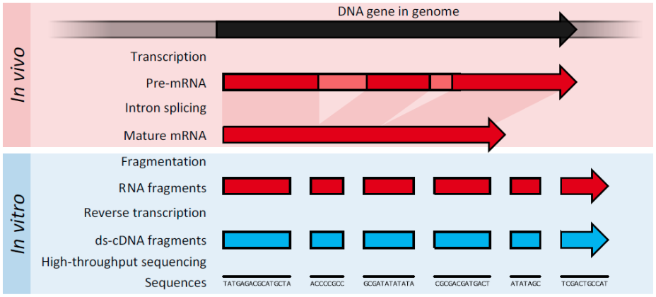
:::

::::{.notes}
::: {style="font-size: 9pt"}
**Obiettivo:** Mostrare il workflow completo della preparazione del campione RNA-seq.

- Percorrere l'immagine dall'alto in basso seguendo il flusso del campione
- Passi chiave: estrazione RNA → selezione/deplezione rRNA → frammentazione → sintesi cDNA → ligazione adattatori → amplificazione PCR → QC libreria
- Ogni step introduce potenziali bias: la standardizzazione è fondamentale
- Tutto questo avviene PRIMA del sequenziamento
:::
::::


##  {background-image="images/back001.jpg" background-size="cover" background-opacity="0.1"}

[RNA Extraction]{.subtit}


::: {.columns}
::: {.column width="40%"}
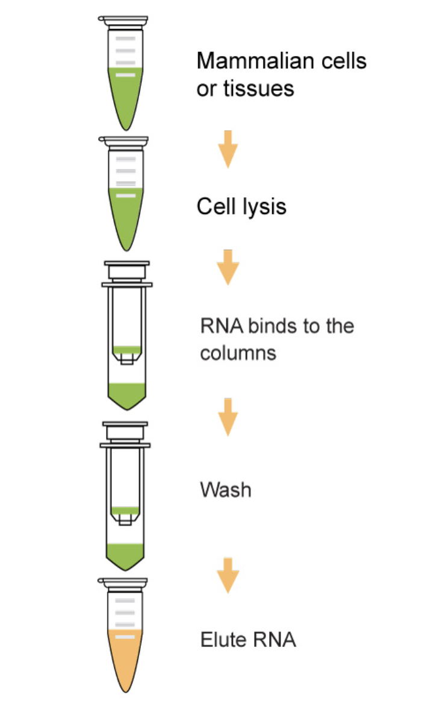{width=400}
:::

::: {.column width="60%"}
*   **Goals:**
    *   Lyse cells/tissues
    *   Remove contaminants (DNA, proteins, lipids)
    *   Preserve RNA integrity
*   **Methods:**
    *   Phenol-chloroform extraction 
    *   **Column-based kits** (silica membrane) 
:::
:::

::::{.notes}
::: {style="font-size: 9pt"}
**Obiettivo:** Spiegare come si estrae l'RNA in modo efficiente e perché la scelta del metodo conta.

- Lisare le cellule/tessuti per rilasciare il contenuto intracellulare
- Rimuovere contaminanti: DNA genomico (DNase), proteine, lipidi
- Fenolo-cloroformio: classico, resa alta, ma laborioso e tossico
- Kit su colonna (es. RNeasy, TRIzol + colonna): rapido, riproducibile, sicuro → standard attuale
- Qualità si valuta con: 260/280 ratio (spettrofotometria) e RIN (Bioanalyzer)
:::
::::

##  {background-image="images/back001.jpg" background-size="cover" background-opacity="0.1"}

[Importance of High-Quality RNA]{.subtit}

::: {.columns}
::: {.column width="40%"}
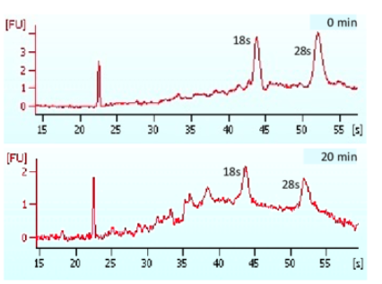{width=600}
:::
::: {.column width="60%"}
*   High-quality RNA is the cornerstone of successful RNA-Seq.
*   Degraded or contaminated RNA can lead to:
    *   Inaccurate gene expression measurements
    *   Misleading conclusions
    *   Wasted time and resources
*   Prevent RNA degradation:
    *   Use RNase-free reagents and equipment.
    *   Store RNA at -80°C.
    *   Minimize freeze-thaw cycles.
:::
:::

::::{.notes}
::: {style="font-size: 9pt"}
**Obiettivo:** Enfatizzare che la qualità dell'RNA è la base irrinunciabile di un esperimento RNA-seq valido.

- Mostrare l'elettroferogramma Bioanalyzer: RIN da 1 (degradato) a 10 (integro)
- RNA degradato introduce bias sistemici: sovrarappresentazione delle regioni 3' dei trascritti
- Standard accettabile: RIN ≥ 7-8 (tessuto fresco); RIN ≥ 5 per campioni FFPE
- Prevenzione: reagenti RNase-free, lavoro in ghiaccio, stoccaggio a -80°C, minimizzare cicli freeze-thaw
- Un campione con basso RIN conviene scartarlo: costi di sequenziamento > costi di ricampionamento
:::
::::

##  {background-image="images/back001.jpg" background-size="cover" background-opacity="0.1"}

[Enrich a specific type of RNA]{.subtit}

- mRNA

- rRNAs and tRNAs (involved in mRNA translation)

- Small nuclear RNAs (involved in splicing)

- Small nucleolar RNAs (involved in the modification of rRNAs)

- microRNA (regulate gene expression at the posttranscriptional level)

- Long noncoding RNAs (chromatin remodelling, transcriptional control and posttranscriptional processing)


#### Two options for mRNA enrichment 

- **mRNA enrichment** – Selectively enriching for poly(A)-tailed transcripts

- **RNA depletion** – Selectively depleting abundant/off-target transcripts 

::::{.notes}
::: {style="font-size: 9pt"}
**Obiettivo:** Spiegare perché si seleziona uno specifico tipo di RNA prima del sequenziamento.

- RNA totale: ~80% è rRNA e tRNA → se non rimossi, sprecano quasi tutta la capacità di sequenziamento
- Target principale RNA-seq standard: mRNA (espressione genica proteina-codificante)
- Poly-A enrichment: captura mRNA maturi con coda poli-A, ma perde lncRNA senza coda poli-A
- rRNA depletion: rimuove rRNA/tRNA con sonde specifiche, cattura quasi tutto il trascrittoma
- Scelta dipende dalla domanda biologica e dalla qualità dell'RNA di partenza
:::
::::

##  {background-image="images/back001.jpg" background-size="cover" background-opacity="0.1"}

[RNA Fragmentation]{.subtit}

:::{.callout-important}
[A sequencing library is essentially a pool of RNA fragments with adapters attached]{style="font-size: 40px"}
:::


*   **Why?**
    *   NGS platform compatibility
    *   Increased library complexity
*   **Methods:**
    *   Enzymatic digestion (e.g., RNase III)
    *   Mechanical shearing (e.g., sonication)

::::{.notes}
::: {style="font-size: 9pt"}
**Obiettivo:** Spiegare perché l'RNA viene frammentato prima della preparazione della libreria.

- Le macchine NGS Illumina sequenziano frammenti corti: tipicamente 50–300 bp
- Frammentazione garantisce copertura uniforme su tutta la lunghezza dei trascritti
- Frammentazione enzimatica (RNase III): taglia dsRNA in modo controllabile → più comune
- Shearing meccanico (sonicazione/ultrasuoni): più usato per DNA genomico
- Dimensione target frammento: ~150 bp per read 2×75 bp; ~300 bp per read 2×150 bp
:::
::::


##  {background-image="images/back001.jpg" background-size="cover" background-opacity="0.1"}

[Attachment of adapters]{.subtit}

1. Adapters are a short, chemically-synthesised oligonucleotide that can be attached to the ends of DNA molecules (cDNA Synthesis: RNA to DNA)

1. Act as barcodes to identify where each nucleotide was originally located

:::{.p-img-center}
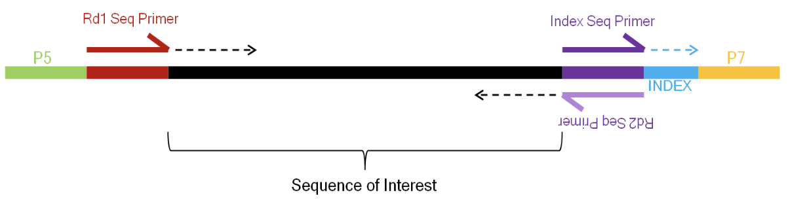{width=900}
:::

::::{.notes}
::: {style="font-size: 9pt"}
**Obiettivo:** Spiegare il ruolo degli adattatori nell'ancoraggio al sequenziatore e nel multiplexing.

- Prima l'RNA viene retrotrascritto in cDNA a doppio filamento
- Gli adattatori (~60-70 nt) vengono ligati alle estremità del cDNA
- Funzioni: (1) ancoraggio alla flow cell Illumina, (2) sito di priming PCR, (3) index/barcode per identificare i campioni
- Il barcode permette il **multiplexing**: decine di campioni nello stesso lane di sequenziamento
- Mostrare l'immagine: P5/P7 come adattatori standard Illumina
:::
::::


##  {background-image="images/back001.jpg" background-size="cover" background-opacity="0.1"}

[Library quantification]{.subtit}

::: {.columns}
::: {.column width="40%"}
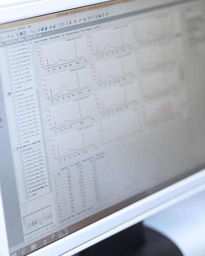{width=600}
:::
::: {.column width="60%"}
*   **Why quantify?**
    *   Optimal sequencing results
    *   Determine loading concentration
    *   Ensure even coverage
*   **Methods:**
    *   Fluorometric methods (e.g., Qubit)
    *   qPCR
    *   Capillary electrophoresis (e.g., Bioanalyzer)
:::
:::

::::{.notes}
::: {style="font-size: 9pt"}
**Obiettivo:** Spiegare come e perché si quantifica la libreria prima del sequenziamento.

- La concentrazione di caricamento sulla flow cell è critica: troppo bassa → pochi cluster; troppo alta → cluster sovrapposti
- Qubit fluorimetrico: misura precisa della concentrazione di DNA a doppio filamento
- qPCR: quantifica SOLO le molecole con adattatori funzionali → più rilevante
- Bioanalyzer/TapeStation: fornisce la distribuzione dimensionale dei frammenti (size distribution)
- Il valore chiave da comunicare al centro di sequenziamento: concentrazione in nM
:::
::::

##  {background-image="images/stat001.jpg" background-size="cover" background-opacity="0.1"}

[How many samples do I need?]{.tit .p-span-center}

::::{.notes}
::: {style="font-size: 9pt"}
**Obiettivo:** Introdurre la domanda critica sulla numerosità campionaria prima di progettare l'esperimento.

- Domanda che ogni ricercatore DEVE porsi PRIMA di spendere soldi in RNA-seq
- Troppo pochi campioni → bassa potenza statistica → risultati non riproducibili
- La risposta formale si ottiene con la **power analysis**
- Chiedere: quanti di voi hanno già usato la power analysis nella loro ricerca?
:::
::::

##  {background-image="images/stat001.jpg" background-size="cover" background-opacity="0.1" auto-animate="true"}

::: {style="font-size: 80px; text-align: center"}
Power analysis
:::

::::{.notes}
::: {style="font-size: 9pt"}
**Obiettivo:** Introdurre il concetto di power analysis come strumento per dimensionare correttamente lo studio.

- La power analysis bilancia 4 parametri interdipendenti: errore α, potenza (1-β), effect size, numerosità n
- Conoscendone 3, si calcola il quarto → di solito vogliamo calcolare n
- È uno strumento obbligatorio PRIMA di iniziare un esperimento
- Nelle slide successive vedremo ciascun parametro nel dettaglio
:::
::::

##  {background-image="images/stat001.jpg" background-size="cover" background-opacity="0.1" auto-animate="true"}

::: {style="font-size: 80px; text-align: center"}
Power analysis
:::

-   **Type I error**: controlled by the α value. Often set to 0.01 (1%) or 0.001 (0.1%) in RNA-seq experiments.

::::{.notes}
::: {style="font-size: 9pt"}
**Obiettivo:** Definire l'errore di tipo I (falso positivo) nel contesto RNA-seq.

- Errore tipo I (α): concludere che un gene è DE quando NON lo è → falso positivo
- α = probabilità di commettere questo errore; tipicamente 0.05 in studi generali
- In RNA-seq si adotta α più stringente (0.01 o 0.001) per correggere i test multipli (migliaia di geni)
- La correzione per test multipli (FDR di Benjamini-Hochberg) è standard in RNA-seq
:::
::::

##  {background-image="images/stat001.jpg" background-size="cover" background-opacity="0.1" auto-animate="true"}

::: {style="font-size: 80px; text-align: center"}
Power analysis
:::

-   **Type I error**: controlled by the α value. Often set to 0.01 (1%) or 0.001 (0.1%) in RNA-seq experiments.

-   **Type II error**: controlled by the β value. (1−β) will give you the power of your analysis. Should be set to 70 or 80% to detect 70 or 80% of the differentially expressed genes. The number of biological replicates might be hard to reach in practice for RNA-seq experiments.

::::{.notes}
::: {style="font-size: 9pt"}
**Obiettivo:** Definire l'errore di tipo II e la potenza statistica.

- Errore tipo II (β): non rilevare un gene veramente DE → falso negativo
- Potenza = 1 - β: probabilità di rilevare un effetto reale; ideale ≥ 0.80 (80%)
- Bassa potenza → molti geni DE non vengono scoperti → risultati incompleti e non riproducibili
- In RNA-seq, con pochi replicati biologici la potenza cala drasticamente
:::
::::

##  {background-image="images/stat001.jpg" background-size="cover" background-opacity="0.1" auto-animate="true"}

::: {style="font-size: 80px; text-align: center"}
Power analysis
:::

-   **Type I error**: controlled by the α value. Often set to 0.01 (1%) or 0.001 (0.1%) in RNA-seq experiments.

-   **Type II error**: controlled by the β value. (1−β) will give you the power of your analysis. Should be set to 70 or 80% to detect 70 or 80% of the differentially expressed genes. The number of biological replicates might be hard to reach in practice for RNA-seq experiments.

-   **Effect size**: this is a parameter you will set. For instance, if you want to investigate genes that differ between treatments with a difference of their mean of 2 then the effect size is equal to 2.

::::{.notes}
::: {style="font-size: 9pt"}
**Obiettivo:** Definire l'effect size come misura della differenza biologica che vogliamo rilevare.

- Effect size (d): grandezza della differenza di espressione che ci interessa rilevare
- In RNA-seq spesso si esprime come fold-change: d=2 corrisponde a ~2 volte di differenza
- Differenze biologiche piccole (d piccolo) richiedono più campioni per essere rilevate
- Il ricercatore sceglie d in base alla rilevanza biologica minima accettabile
:::
::::

##  {background-image="images/stat001.jpg" background-size="cover" background-opacity="0.1" auto-animate="true"}

::: {style="font-size: 80px; text-align: center"}
Power analysis
:::

-   **Type I error**: controlled by the α value. Often set to 0.01 (1%) or 0.001 (0.1%) in RNA-seq experiments.

-   **Type II error**: controlled by the β value. (1−β) will give you the power of your analysis. Should be set to 70 or 80% to detect 70 or 80% of the differentially expressed genes. The number of biological replicates might be hard to reach in practice for RNA-seq experiments.

-   **Effect size**: this is a parameter you will set. For instance, if you want to investigate genes that differ between treatments with a difference of their mean of 2 then the effect size is equal to 2.

-   **Sample size**: the quantity you want to calculate.

::::{.notes}
::: {style="font-size: 9pt"}
**Obiettivo:** Riepilogare i 4 parametri della power analysis e come interagiscono.

- I 4 parametri sono interdipendenti: fissandone 3, il quarto è determinato
- Per calcolare n: fissare α (es. 0.05), β (es. 0.2 → potenza 80%), e d (es. 2)
- Aumentare n → aumenta la potenza ma aumenta i costi
- Compromesso: trovare il bilanciamento tra potenza desiderata e fattibilità pratica/budget
:::
::::

##  {background-image="images/stat001.jpg" background-size="cover" background-opacity="0.1"}

#### Let's say we want:

-   Type I error of 5%. (α=0.05)
-   Type II error of 0.2. (Power=1−β=0.8)
-   Effect size of 2. (d=2)

::: {.fragment .fade-in}
```{r}
#| echo: TRUE
#| eval: false
#| code-line-numbers: "1|3|4|5|1-7"
library("pwr")

pwr.t.test(d = 2,
           power = .8,
           sig.level = .05,
           type = "two.sample",
           alternative = "two.sided")
```
:::

::::{.notes}
::: {style="font-size: 9pt"}
**Obiettivo:** Dimostrare come eseguire la power analysis in R con un effect size grande (d=2).

- Caricare il pacchetto `pwr`; funzione `pwr.t.test()` per confronti tra due gruppi
- d=2, potenza 80%, α=0.05, test bilaterale a due campioni
- Il risultato: n ≈ 6-7 campioni per gruppo → abbastanza fattibile
- Interpretare l'output: n è per GRUPPO, non totale
- Soffermarsi sulle righe una alla volta grazie a `code-line-numbers`
:::
::::

##  {background-image="images/stat001.jpg" background-size="cover" background-opacity="0.1"}

#### Let's say we want:

-   Effect size of 1. (d=1)

::: {.fragment .fade-in}
```{r}
#| echo: TRUE
#| eval: false
library("pwr")

pwr.t.test(d = 1,
           power = .8,
           sig.level = .05,
           type = "two.sample",
           alternative = "two.sided")
```
:::

::::{.notes}
::: {style="font-size: 9pt"}
**Obiettivo:** Mostrare come un effect size più piccolo richieda campioni aggiuntivi.

- Confrontare con il caso precedente: d=1 vs d=2
- Il risultato: n ≈ 17 per gruppo → più del doppio rispetto a d=2!
- Messaggio chiave: effetti biologici piccoli richiedono esperimenti costosi
- Discutere: qual è l'effect size biologicamente rilevante nel loro studio?
- In RNA-seq, spesso si considera DE un gene con |log2FC| ≥ 1 (fold-change ≥ 2)
:::
::::

##  {background-image="images/stat001.jpg" background-size="cover" background-opacity="0.1"}

[Power analysis for RNA-seq]{.tit .p-span-center}

::::{.notes}
::: {style="font-size: 9pt"}
**Obiettivo:** Passare dalle considerazioni generali sulla power analysis alle specificità degli esperimenti RNA-seq.

- RNA-seq ha caratteristiche uniche: migliaia di geni testati simultaneamente, distribuzione NB dei conteggi
- Gli strumenti generici (come `pwr`) sono un punto di partenza ma non catturano la complessità reale
- Strumenti specifici per RNA-seq: RNASeqSampleSize, Scotty, ssizeRNA
- Messaggio chiave: pianificare PRIMA di raccogliere i campioni
:::
::::

##  {background-image="images/stat001.jpg" background-size="cover" background-opacity="0.1" auto-animate="true"}

::: {style="font-size: 60px; text-align:center"}
**General Considerations**
:::

<br>

::: {style="font-size: 60px"}
RNA-seq experiments often suffer from a low statistical power
:::

::::{.notes}
::: {style="font-size: 9pt"}
**Obiettivo:** Evidenziare che la bassa potenza statistica è un problema cronico e sistematico negli esperimenti RNA-seq pubblicati.

- Studi di meta-analisi dimostrano che molti esperimenti RNA-seq hanno potenza < 0.5
- Conseguenza: i geni DE identificati sono solo una frazione del totale reale
- Bassa potenza → difficoltà di replicazione tra laboratori diversi
- Invitare a riflettere: quanti dei loro esperimenti passati avevano ≥ 5 replicati biologici per condizione?
:::
::::

##  {background-image="images/stat001.jpg" background-size="cover" background-opacity="0.1" auto-animate="true"}

::: {style="font-size: 60px; text-align:center"}
**General Considerations**
:::

<br>

::: {style="font-size: 60px"}
RNA-seq experiments often suffer from a low statistical power
:::

<br>

::: {style="font-size: 60px"}
Low power can lead to a lack of reproducibility of the research findings
:::

::::{.notes}
::: {style="font-size: 9pt"}
**Obiettivo:** Collegare bassa potenza e scarsa riproducibilità come problema sistemico in biologia molecolare.

- Bassa potenza → molti geni DE reali non vengono trovati → lista DE incompleta
- Due laboratori diversi con n=3 per gruppo spesso ottengono risultati poco sovrapposti
- La crisi di riproducibilità in biologia è in parte dovuta a studi sottopotenziati
- Soluzione pratica: aumentare il numero di replicati o selezionare target con effetti più grandi
:::
::::

##  {background-image="images/stat001.jpg" background-size="cover" background-opacity="0.1" auto-animate="true"}

::: {style="font-size: 60px; text-align:center"}
**General Considerations**
:::

<br>

::: {style="font-size: 60px"}
RNA-seq experiments often suffer from a low statistical power
:::

<br>

::: {style="font-size: 60px"}
Low power can lead to a lack of reproducibility of the research findings
:::

<br>

::: {style="font-size: 60px"}
The number of replicates is one of the critical parameter related to the power of an analysis
:::

::::{.notes}
::: {style="font-size: 9pt"}
**Obiettivo:** Sottolineare che il numero di replicati è la leva principale sulla potenza statistica.

- Il fattore più controllabile dal ricercatore è n (numero di campioni)
- Aumentare n da 3 a 6 può raddoppiare la potenza in molti scenari RNA-seq
- Il terzo punto è il messaggio chiave di questa sezione: più replicati > maggiore profondità di sequenziamento
- Prepara la discussione sulla figura di Liu et al. che verrà subito dopo
:::
::::

##  {background-image="images/stat001.jpg" background-size="cover" background-opacity="0.1"}

[Replicates]{.tit .p-span-center}

::::{.notes}
::: {style="font-size: 9pt"}
**Obiettivo:** Introdurre la distinzione fondamentale tra replicati tecnici e biologici.

- Definire i due tipi prima di mostrare la figura
- Replicato tecnico: stesso campione biologico, step di laboratorio ripetuto → cattura varianza tecnica
- Replicato biologico: individui/campioni biologici diversi della stessa condizione → cattura varianza biologica reale
- In RNA-seq siamo interessati alla varianza biologica → serve il replicato biologico
:::
::::

##  {background-image="images/stat001.jpg" background-size="cover" background-opacity="0.1"}

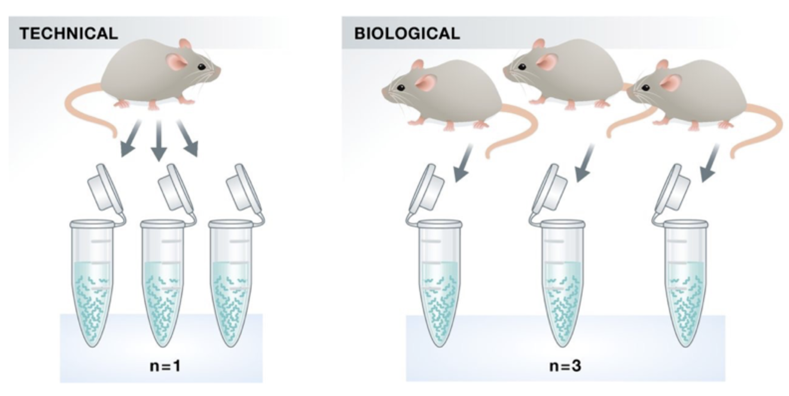

::::{.notes}
::: {style="font-size: 9pt"}
**Obiettivo:** Distinguere chiaramente replicati tecnici e biologici usando la figura di Klaus B.

- Replicati tecnici: stesso campione biologico, passaggi tecnici ripetuti → misurano la variazione tecnica
- Replicati biologici: campioni biologici diversi della stessa condizione → misurano la variazione biologica
- La figura mostra perché i replicati biologici contano di più per l'inferenza statistica
- Collegare al concetto di potenza statistica discusso in precedenza
:::
::::

##  {background-image="images/stat001.jpg" background-size="cover" background-opacity="0.1"}

[Do we need technical replicates?]{.tit .p-span-center}

::::{.notes}
::: {style="font-size: 9pt"}
**Obiettivo:** Porre una domanda retorica per catturare l'attenzione prima della risposta.

- Attendere qualche secondo prima di rispondere
- Chiedere agli studenti cosa ne pensano
- Le aspettative possono variare: chi viene da PCR/qPCR è abituato ai replicati tecnici
:::
::::

##  {background-image="images/stat001.jpg" background-size="cover" background-opacity="0.1" auto-animate="true"}

[No]{.tit .p-span-center}

::::{.notes}
::: {style="font-size: 9pt"}
**Obiettivo:** Dare la risposta di impatto prima di spiegarla.

- La risposta diretta sorprende chi si aspettava sì
- Creare suspense: "E perché no?"
- La spiegazione arriva nella slide successiva con il callout
:::
::::

##  {background-image="images/stat001.jpg" background-size="cover" background-opacity="0.1" auto-animate="true"}

[No]{.tit .p-span-center}

::: callout-important
[With the current RNA-Seq technologies, technical variation is much lower than biological variation and technical replicates are unneccessary]{.f40}
:::

::::{.notes}
::: {style="font-size: 9pt"}
**Obiettivo:** Spiegare perché i replicati tecnici sono superflui nell'RNA-seq moderno.

- La variazione tecnica di Illumina è estremamente bassa (<1% coefficient of variation)
- La varianza biologica tra individui/campioni è di ordini di grandezza più alta
- Con i replicati tecnici sprechiamo slot di sequenziamento che potrebbero essere campioni biologici aggiuntivi
- Eccezione: pilot studies per validare un nuovo protocollo di estrazione
:::
::::

##  {background-image="images/stat001.jpg" background-size="cover" background-opacity="0.1"}

[Do we need biological replicates?]{.tit .p-span-center}

::::{.notes}
::: {style="font-size: 9pt"}
**Obiettivo:** Creare contrasto simmetrico con la domanda precedente sui replicati tecnici.

- Stessa struttura retorica della slide precedente: domanda → risposta drammatica
- Chiedere agli studenti: questa volta cosa rispondete?
- La risposta è opposta e ancora più enfatica
:::
::::

##  {background-image="images/stat001.jpg" background-size="cover" background-opacity="0.1" auto-animate="true"}

[YES]{.tit .p-span-center}

::::{.notes}
::: {style="font-size: 9pt"}
**Obiettivo:** Dare la risposta enfatica prima di spiegare il perché.

- Pausa drammatica dopo YES
- I replicati biologici sono NON NEGOZIABILI per l'analisi DE
- Senza replicati biologici non è possibile stimare la varianza → nessun test statistico valido
- Minimo: n=3 per condizione; raccomandato: n=5 o più
:::
::::

##  {background-image="images/stat001.jpg" background-size="cover" background-opacity="0.1" auto-animate="true"}

[YES]{.tit .p-span-center}

::: callout-important
[Biological replicates are absolutely essential for [differential expression analysis]{.rn}]{.f40}
:::

::::{.notes}
::: {style="font-size: 9pt"}
**Obiettivo:** Enfatizzare che i replicati biologici sono il prerequisito dell'analisi DE.

- Il testo sottolineato ({.rn}) attira l'attenzione sull'analisi differenziale
- Senza replicati → impossibile distinguere segnale biologico da rumore casuale
- Ricordare: con n=1 per condizione i tool come DESeq2 si rifiutano di girare
- Chi ci ha provato con n=2? Spesso risultati inconsistenti e inaffidabili
:::
::::

##  {background-image="images/stat001.jpg" background-size="cover" background-opacity="0.1" auto-animate="true"}

[YES]{.tit .p-span-center}

::: callout-important
[For differential expression analysis, the more biological replicates, the better the estimates of biological variation and the more precise our estimates of the mean expression levels]{.f40}
:::

::::{.notes}
::: {style="font-size: 9pt"}
**Obiettivo:** Comunicare che "più replicati = stime migliori" sia per la media che per la varianza.

- Con n grande: stima della media di espressione più stabile → minore errore standard
- Con n grande: stima della dispersione più precisa → DESeq2 usa questo per informare lo shrinkage
- Il messaggio "più è meglio" è vero, ma con rendimenti decrescenti oltre n=10-12
- Nella slide seguente vedremo i dati di Liu et al. che quantificano questo effetto
:::
::::

##  {background-image="images/stat001.jpg" background-size="cover" background-opacity="0.1"}

::: {.f40 .tcenter .fragment}
Biological replicates are of greater importance than sequencing depth
:::

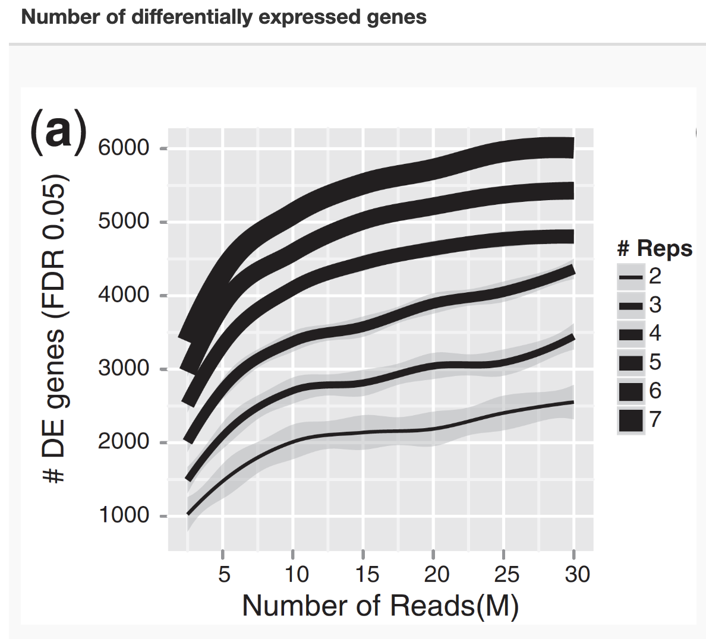{width="auto" height="700"}

:::{.notes}
[Cosa vedete? Come interpretate il grafico]{style="font-size: 50px; color: red"}

Note that an increase in the number of replicates tends to return more DE genes than increasing the sequencing depth. 
:::


#  {background-image="images/back001.jpg" background-size="cover" background-opacity="0.1"}


[Introduction to RNA Sequencing]{.tit .p-span-center}

[(Primary analysis)]{.p-span-center}

::::{.notes}
::: {style="font-size: 9pt"}
**Obiettivo:** Introdurre la sezione sull'analisi primaria: dal FASTQ ai conteggi.

- Questa sezione copre il "perché" dell'RNA-seq e la storia della tecnologia
- Focus: come funziona fisicamente il sequenziamento (Illumina principale)
- I dottorandi raramente eseguono manualmente questa parte → importante capire i principi
- La comprensione della tecnologia aiuta a interpretare gli artefatti nei dati
:::
::::

##  {background-image="images/back001.jpg" background-size="cover" background-opacity="0.1"}

[The central dogma]{.subtit}

::: {.p-img-center}
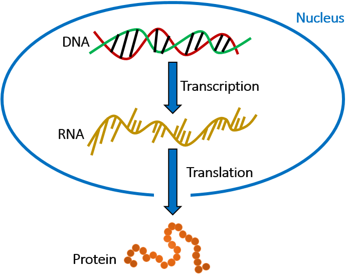
:::


:::{.tcenter}
*   **DNA:** The blueprint of genetic information
*   **RNA:** The messenger carrying genetic instructions
*   **Protein:** The functional molecules in cells
:::

::::{.notes}
::: {style="font-size: 9pt"}
**Obiettivo:** Ricordare il dogma centrale come contesto biologico dell'RNA-seq.

- DNA → trascrizione → RNA → traduzione → Proteina
- L'RNA è il messaggero intermedio: ci dice quanta proteina una cellula sta producendo ORA
- Il DNA è stabile (identico in quasi tutte le cellule); l'RNA cambia in risposta all'ambiente
- RNA-seq misura il "trascrittoma" = tutte le molecole di RNA presenti in un momento dato
:::
::::


##  {background-image="images/back001.jpg" background-size="cover" background-opacity="0.1"}

[Why Study RNA?]{.subtit}

::: {.p-img-center}
```{r}
#| echo: false
#| eval: false
#| layout-ncol: 1
plot(qrcode::qr_code("https://forms.gle/b6byBimmjCfM91uU6"))
```

:::

::::{.notes}
::: {style="font-size: 9pt"}
**Obiettivo:** Coinvolgere gli studenti con una domanda interattiva prima di illustrare le motivazioni.

- Far scansionare il QR code agli studenti (se presente)
- Chiedere: "Perché state facendo RNA-seq nel vostro lab? Quale domanda biologica volete rispondere?"
- Raccogliere le risposte e collegarle ai punti nelle slide successive
- Questo crea engagement e contestualizza il corso nel loro lavoro
:::
::::


##  {background-image="images/back001.jpg" background-size="cover" background-opacity="0.1"}

[Why Study RNA?]{.subtit}

:::: {.columns}
::: {.column width="40%"}
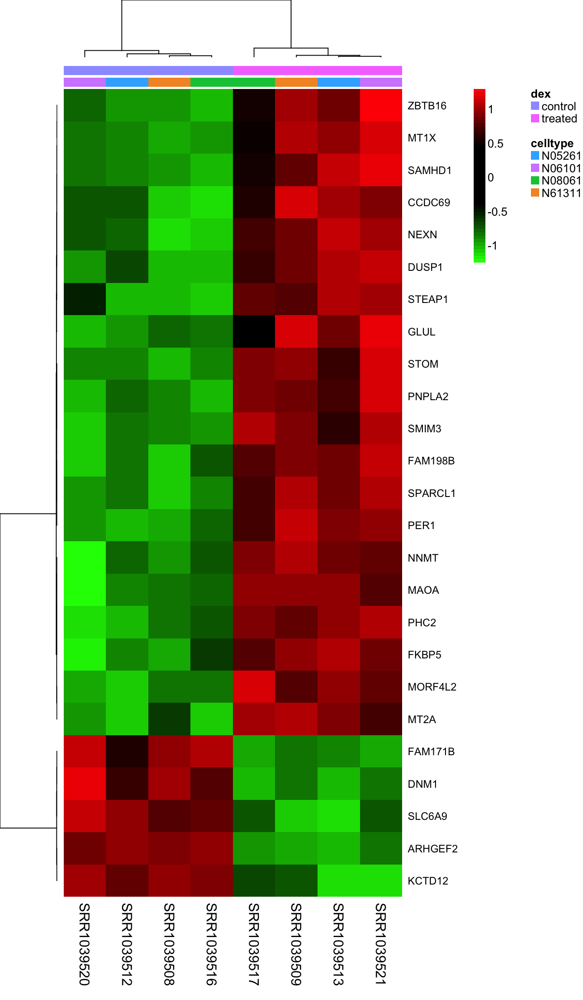{width=400}
:::
::: {.column .f40}
*   **Dynamic reflection of cellular activity:**  Unlike DNA, which is relatively static, RNA levels change rapidly in response to internal and external stimuli. 
    *   Provides a snapshot of what genes are actively being expressed at a specific time.
*   **Understanding gene regulation:** Studying RNA helps us understand how genes are turned on or off, and to what extent, in different conditions.
:::
:::: 

::::{.notes}
::: {style="font-size: 9pt"}
**Obiettivo:** Illustrare i vantaggi principali dello studio dell'RNA rispetto al DNA.

- L'RNA è dinamico: cambia in risposta a farmaci, stress, differenziamento, malattia
- L'heatmap mostra come campioni si raggruppano per profilo di espressione → potere classificativo
- L'RNA rivela "chi comanda" in una cellula in un preciso momento biologico
- Esempio concreto dal loro laboratorio: trattamento farmacologico → quali geni cambiano?
:::
::::

##  {background-image="images/back001.jpg" background-size="cover" background-opacity="0.1"}

[Why Study RNA?]{.subtit}

::: {.columns}
::: {.column width="40%"}
{width=400}
:::
::: {.column .f40}
*   **Insights into cellular processes:**  RNA plays diverse roles in many cellular processes, including:
    *   Protein synthesis (mRNA)
    *   Gene regulation (microRNAs, long non-coding RNAs)
    *   Catalysis (ribozymes)
*   **Disease biomarkers and drug targets:**  Changes in RNA expression can be indicative of disease states, making RNA a valuable source of biomarkers for diagnosis and prognosis. 
:::
::: 

::::{.notes}
::: {style="font-size: 9pt"}
**Obiettivo:** Completare la motivazione biologica con le applicazioni cliniche e traslazionali.

- RNA come biomarker diagnostico: firme di espressione genica per sottotipi tumorali (es. PAM50 nel cancro al seno)
- Drug targets: geni overexpressed in patologia → candidati per terapie mirate
- Ribozimi: RNA cataliticamente attivi → fanno vedere che l'RNA non è solo un messaggero
- lncRNA: ex "junk DNA", ora riconosciuti come regolatori chiave del genoma
:::
::::


<!-- ##  {background-image="images/back001.jpg" background-size="cover" background-opacity="0.1"}

[Why RNA Sequencing?]{.subtit}

::: {.columns .f60}
::: {.column}
*   **Microarrays:**
    *   Limited to known genes
    *   Lower sensitivity
    *   Hybridization biases
:::
::: {.column}
*   **RNA-Seq:**
    *   Unbiased and comprehensive
    *   Higher sensitivity
    *   Wider range of applications
:::
::: 

::: {.notes}
- **Limitations of older techniques**: Explain that while microarrays were useful, they had significant drawbacks

- **Enter RNA-Seq**: Introduce RNA-Seq as a revolutionary technology that overcomes these limitations
 
---

- **Create a sense of progress**: Explain how RNA-Seq represents a significant advancement over previous methods.

- **Highlight the "discovery" aspect**: Emphasize that RNA-Seq allows researchers to explore the unknown and uncover new biological insights.
::: -->

##  {background-image="images/back001.jpg" background-size="cover" background-opacity="0.1"}

[The Power of RNA-Seq]{.subtit}

::: {.columns}
::: {.column}
*   **Unbiased & Comprehensive:**
    *   Discovers novel transcripts
    *   Not limited to known genes

*   **Higher Sensitivity:**
    *   Detects rare transcripts
    *   Wider dynamic range
:::
::: {.column}
*   **Alternative Splicing:**
    *   Identifies and quantifies isoforms

*   **Mutation Detection:**
    *   SNPs, indels, fusion genes

*   **Non-Coding RNAs:**
    *   Studies microRNAs, lncRNAs, etc.
:::
::: 


::: {.notes}
- "Wide dynamic range" refers to the ability of a system or device to accurately capture and represent a broad range of signal intensities

- lncRNAs, or long non-coding RNAs, are a type of RNA molecule that is not translated into protein.  They were once considered "junk" DNA, but are now recognized as crucial regulators of gene expression and cellular processes
:::


##  {background-image="images/back001.jpg" background-size="cover" background-opacity="0.1"}

[A Brief History of Sequencing]{.subtit}


::: {.p-img-center}
```{r}
#| echo: false
#| eval: false
#| layout-ncol: 1
plot(qrcode::qr_code("https://forms.gle/rWcwyAiA4L7EG8pm7"))
```

:::

::::{.notes}
::: {style="font-size: 9pt"}
**Obiettivo:** Coinvolgere gli studenti con una domanda interattiva sulla storia del sequenziamento.

- Far scansionare il QR code agli studenti (se presente)
- Domanda possibile: "Quando è stato sequenziato il primo genoma umano completo?"
- Usa le risposte per introdurre la rivoluzione portata dall'NGS
- L'obiettivo è contestualizzare la rapid evoluzione tecnologica
:::
::::


##  {background-image="images/back001.jpg" background-size="cover" background-opacity="0.1"}

[First generation NGS]{.tit .p-span-center}

::::{.notes}
::: {style="font-size: 9pt"}
**Obiettivo:** Introdurre la prima generazione di sequenziamento come punto di partenza storico.

- Il Sanger sequencing (1977) è la base da cui tutto è partito
- Fred Sanger vinse due Premi Nobel per la chimica (1958 e 1980)
- Tecnologia capace di 1 kb per reazione, usata per il Progetto Genoma Umano
- Ancora oggi gold standard per la validazione di varianti singole e PCR products
:::
::::


##  {background-image="images/back001.jpg" background-size="cover" background-opacity="0.1"}

[Sanger Sequencing]{.subtit}

<br>

:::{.p-img-center}
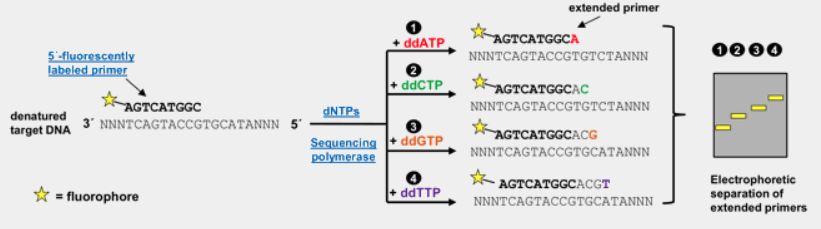{width=1500}
:::

:::{.notes}
- I dideossinucleotidi trifosfati (ddNTP) mancano del gruppo 3'-OH dei dNTP, essenziale per l'allungamento del filamento mediato dalla polimerasi in una PCR.

- Le marcature radioattive, instabili, rappresentavano un rischio per la salute e richiedevano gel separati per ciascuna delle quattro basi del DNA.

- La sintesi del filamento di DNA complementare inizia nel sito specifico di innesco e termina con l'incorporazione di un ddNTP terminatore di catena che viene introdotto casualmente al posto del corrispondente dNTP.

- Quando questi frammenti vengono separati su una matrice di gel appropriata, l'informazione sulla sequenza può essere ottenuta dall'ordine di migrazione delle bande (dal basso verso l'alto).
:::

##  {background-image="images/back001.jpg" background-size="cover" background-opacity="0.1"}

[Sanger Sequencing]{.subtit}

<br>

:::{.p-img-center}
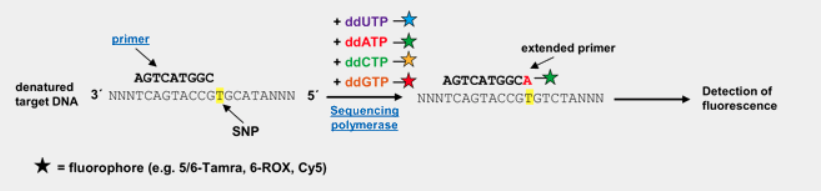{width=1500}
:::

:::{.notes}
- Leroy Hood sviluppò una tecnica chimica che utilizzava coloranti fluorescenti di diversi colori, uno per ciascuna delle quattro basi del DNA. Questo sistema di "codifica a colori" eliminò la necessità di eseguire diverse reazioni in gel sovrapposti.

- Hood integrò la tecnologia laser e informatica, eliminando il tedioso processo di raccolta manuale delle informazioni.

- ddATP, ddCTP, ddGTP e ddUTP marcati con fluorescenza.

- La successiva visualizzazione fluorescente del prodotto rivela il nucleotide incorporato e quindi la sequenza.
:::

##  {background-image="images/back001.jpg" background-size="cover" background-opacity="0.1"}

[Sanger Sequencing ]{.subtit}

:::: {.columns .f30}

::: {.column width="40%"}
**Advantages** 

1. Gold standard method for accurate detection of single nucleotide variants and small insertions/deletions

1. Cost effective where single samples need to be tested very urgently

1. Less reliant on computational tools than NGS

1. Longer fragments (up to approximately 1000bp) can be sequenced than in short read NGS
:::

::: {.column width="10%"}
:::

::: {.column width="40%"}
**Limitations** 

1. Limited throughput

1. Not cost effective for sequencing many genes in parallel

1. Can require a larger amount of input DNA than NGS

1. Sanger methods can only sequence short pieces of DNA--about 300 to 1000 base pairs.

1. The quality of a Sanger sequence is often not very good in the first 15 to 40 bases because that is where the primer binds.

1. Sequence quality degrades after 700 to 900 bases
:::

::::

::::{.notes}
::: {style="font-size: 9pt"}
**Obiettivo:** Fare un bilancio onesto dei punti di forza e debolezza del Sanger sequencing.

- Pro chiave: accuratezza altissima (>99.99%) → gold standard per validazione
- Pro chiave: lunghi read (fino a 1000 bp) → utile per sequenziare regioni difficili
- Contro chiave: throughput basso → non scalabile a livello genomico/trascrittomica
- Nel contesto RNA-seq: usato per validare singoli risultati DE, non per discovery
- Segue una domanda interattiva (QR code)
:::
::::

##  {background-image="images/back001.jpg" background-size="cover" background-opacity="0.1"}

[Sanger Sequencing ]{.subtit}

::: {.p-img-center}
```{r}
#| echo: false
#| eval: false
#| layout-ncol: 1
plot(qrcode::qr_code("https://forms.gle/b6byBimmjCfM91uU6"))
```

:::

::::{.notes}
::: {style="font-size: 9pt"}
**Obiettivo:** Verifica interattiva della comprensione prima di passare all'NGS.

- Far scansionare il QR code — possibile domanda: "Qual è il limite principale del Sanger?"
- Usare le risposte per motivare il passaggio all'NGS nella slide successiva
- Transizione: "Il throughput limitato ha spinto la ricerca verso tecnologie parallele"
:::
::::


##  {background-image="images/back001.jpg" background-size="cover" background-opacity="0.1"}

[Second generation NGS]{.subtit}

<br>

:::{.callout-important appearance="default"}
[Second-generation NGS machines immediately began to drive the 'genomics revolution' by massively increased throughput by parallelizing many reactions]{style="font-size: 50px; font-family: 'Julius Sans One', sans-serif"}
:::

::::{.notes}
::: {style="font-size: 9pt"}
**Obiettivo:** Comunicare il salto quantitativo tra Sanger e NGS di seconda generazione.

- La chiave è la PARALLELIZZAZIONE: milioni di reazioni simultanee su una flow cell
- Costo per base: da ~$1 (Sanger) a ~$0.000001 (Illumina NovaSeq)
- Questo ha reso possibile sequenziare interi trascrittomi per pochi centinaio di euro
- Nella slide seguente i tre sistemi più importanti della 2a gen
:::
::::

##  {background-image="images/back001.jpg" background-size="cover" background-opacity="0.1"}

[Second generation NGS]{.subtit}

<br>

Second-generation sequencing platforms:

1. SOLiD: Sequencing by Oligonucleotide Ligation and Detection

1. 454 GS FLX+: It uses pyrosequencing chemistry

1. NextSeq 550Dx: Sequence by synthesis

:::{.notes}
1. SOLiD: Life Technologies in 2006

1. 454: Roche in 2011

1. NextSeq 550Dx: Illumina in 2017 
:::

##  {background-image="images/back001.jpg" background-size="cover" background-opacity="0.1"}

[Sequence by Ligation]{.subtit}

<br>

::::{.columns}

:::{.column width="55%"}
:::{.r-stack .p-img-center}
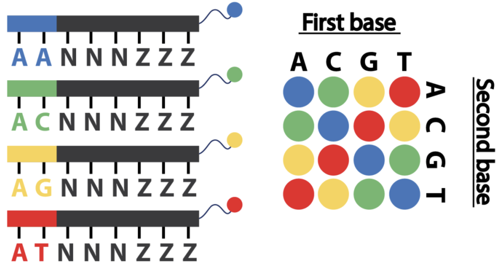{width="900"}

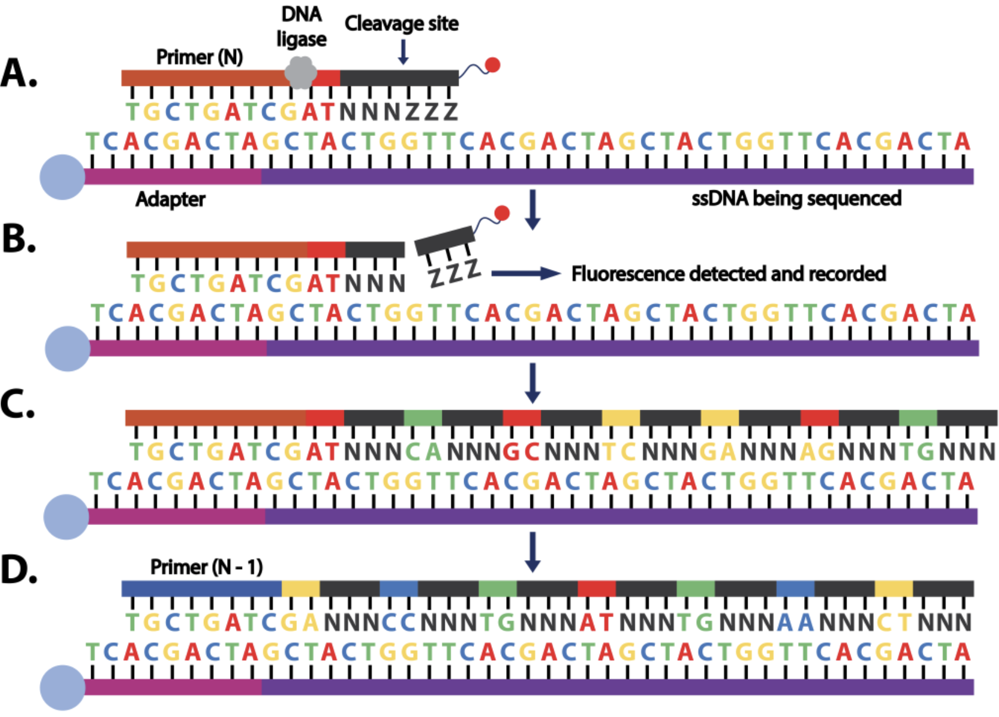{.fragment width="900"}
:::
:::

:::{.column width="45%"}

<br>

:::{.fragment}
- `r fontawesome::fa("plus-circle", fill = "green")` Considered to be one of the most accurate second-generation sequencing technologies

- `r fontawesome::fa("minus-circle", fill = "red")` it can take up to seven days to complete a  single run and its short read length of 35 bp

- `r fontawesome::fa("minus-circle", fill = "red")` Thermo Fisher Scientific shut down all SOLiD sequencing platforms in 2016
:::
:::
::::

:::{.notes}
- Fluorescently labeled molecules called 8-mers

- 8-mers are short ssDNA fragments where: 

    - the first and second nucleotides are the next two nucleotides of the elongating DNA strand    
    - the third-to-fifth nucleotides are degenerate     
    - the sixth to eighth nucleotides are inosine bases, where the eighth inosine base is attached to a characteristic fluorescent dye

A. The addition of primer and 8-mers, where if the first two nucleotides are complementary, DNA ligase ligates it to the primer.    
B. Unbound 8-mers are washed away, and a laser excites the fluorescent tag on the 8-mer to emit a detectable light signal that is captured    
C. A-B is repeated until the end of the DNA fragment.    
D. The newly synthesized DNA strand is melted off, and A-C is repeated using a primer with a length of N-1, N-2, and N-3

:::


##  {background-image="images/back001.jpg" background-size="cover" background-opacity="0.1"}

[Pyrosequencing]{.subtit}

::::{.columns}

:::{.column width="45%"}
:::{.p-img-center}
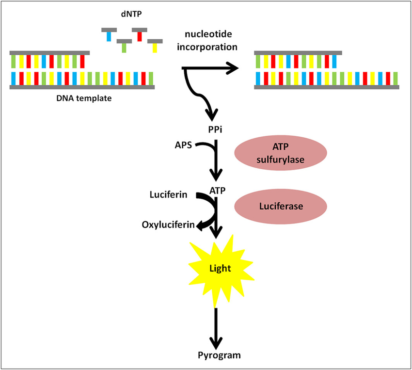{width=800}
:::

:::

:::{.column width="10%"}
:::

:::{.column width="45%"}
<br>
<br>

:::{.fragment}
- `r fontawesome::fa("plus-circle", fill = "green")` Large read lenght generation

- `r fontawesome::fa("minus-circle", fill = "red")` High reagent cost

- `r fontawesome::fa("minus-circle", fill = "red")` High error rate for homopolymers
:::
:::
::::

:::{.notes}
Durante il sequenziamento vengono, di volta in volta, aggiunti dei nucleotidi. 

Se il nucleotide viene incorporato viene rilasciato un pirofosfato 

Poi utilizzato come substrato dall'enzima ATP solforilasi. 

Quest'ultimo enzima catalizza la conversione del pirofosfato in ATP. 

L'ATP a sua volta è il cofattore utilizzato dalla luciferasi per catalizzare la reazione che coinvolge la luciferina e che porta alla produzione di luce. 

La luce generata, solo in seguito alla incorporazione del nucleotide corretto,viene rilevata grazie ad un detector.
:::

##  {background-image="images/back001.jpg" background-size="cover" background-opacity="0.1"}

[Sequence by synthesis]{.subtit}

::::{.notes}
::: {style="font-size: 9pt"}
**Obiettivo:** Introdurre la tecnologia SBS (Illumina) che domina il mercato RNA-seq oggi.

- SBS = Sequencing by Synthesis: lettura base per base durante la sintesi del DNA
- È la tecnologia che i loro campioni usano quasi certamente
- La slide successiva è una foto storica: indovinano dov'è?
- Creare curiosità prima di mostrare l'immagine
:::
::::

##  {background-image="images/pant.jpg" background-size="cover" background-opacity="1"}

:::{.notes}
Birthplace of high-throughput sequencing
:::

##  {background-image="images/back001.jpg" background-size="cover" background-opacity="0.1"}

[Sequence by synthesis - History]{.subtit}

<br>

[1997]{style="font-family: 'Rock Salt', cursive;font-size: 60px"}: [Evolution of a Novel Approach to Sequencing]{style="font-size: 70px"}

:::{.p-img-center}
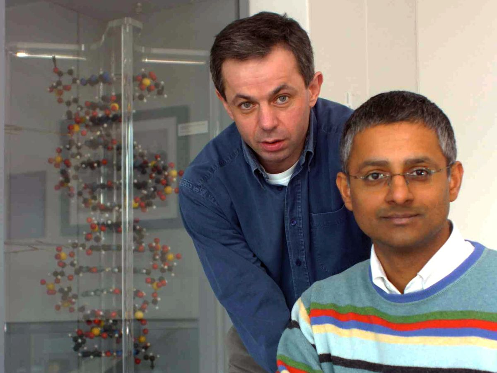{width=600}
:::

:::{.tcenter}
Shankar Balasubramanian and David Klenerman
:::


:::{.notes}
- Cambridge scientists Shankar Balasubramanian, Ph.D. and David Klenerman, Ph.D. were using fluorescently labeled nucleotides to observe the motion of a polymerase at the single molecule level as it synthesized DNA immobilized to a surface

- during the summer of 1997 sparked ideas surrounding the use of clonal arrays and massively parallel sequencing of short reads using solid phase sequencing by reversible terminators

- This technology was subsequently referred to as sequencing by synthesis technology, or SBS. This became the basis of an innovative DNA sequencing approach.
:::

##  {background-image="images/back001.jpg" background-size="cover" background-opacity="0.1"}

[Sequence by synthesis - History]{.subtit}

<br>

[1998]{style="font-family: 'Rock Salt', cursive;font-size: 60px"}: [Formation of Solexa]{style="font-size: 70px"}

:::{.p-img-center}
{width=600}
:::

::::{.notes}
::: {style="font-size: 9pt"}
**Obiettivo:** Raccontare la fondazione di Solexa come il momento in cui la tecnologia SBS diventa un'azienda.

- Balasubramanian e Klenerman fondano Solexa per commercializzare il SBS
- Idea nata da conversazione informale al campo da golf a Cambridge nel 1997!
- Solexa = "Sequencing by Ligation and Extension" (nome originale del metodo)
- Da slide precedente: dal paper accademico alla startup in un anno
:::
::::


##  {background-image="images/back001.jpg" background-size="cover" background-opacity="0.1"}

[Sequence by synthesis - History]{.subtit}

<br>

[2004]{style="font-family: 'Rock Salt', cursive;font-size: 60px"}: [Molecular Clustering Technology Integration]{style="font-size: 70px"}

:::{.p-img-center}
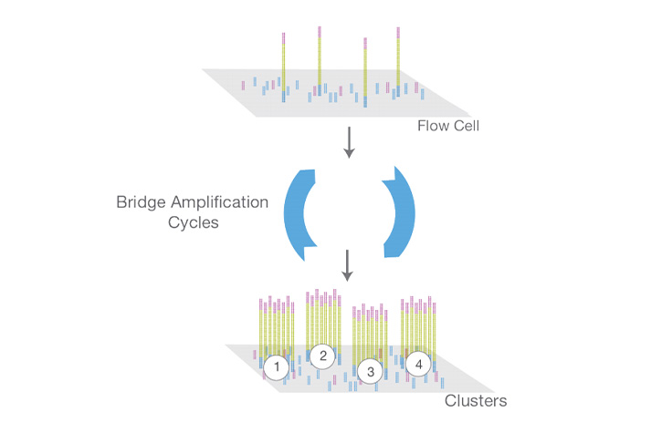{width=800}
:::

:::{.tcenter}
Cluster generation (also known as "bridge amplification")
:::


:::{.notes}
- Solexa acquired molecular clustering technology from Manteia. 

- The amplification of single DNA molecules into clusters enhanced the fidelity and accuracy of gene calling, while reducing the cost of the system optics through generation of a stronger signal.
:::

##  {background-image="images/back001.jpg" background-size="cover" background-opacity="0.1"}

[Sequence by synthesis - History]{.subtit}

<br>

[2005]{style="font-family: 'Rock Salt', cursive;font-size: 60px"}: [phiX-174 Genome Sequencing]{style="font-size: 70px"}

:::{.fragment}
[2005]{style="font-family: 'Rock Salt', cursive;font-size: 60px"}: [Integration of Lynx Therapeutics]{style="font-size: 70px"}
:::

:::{.fragment}
[2007]{style="font-family: 'Rock Salt', cursive;font-size: 60px"}: [Illumina Acquires Solexa]{style="font-size: 70px"}

::::{.columns}

:::{.column width="45%"}
:::{.p-img-center}
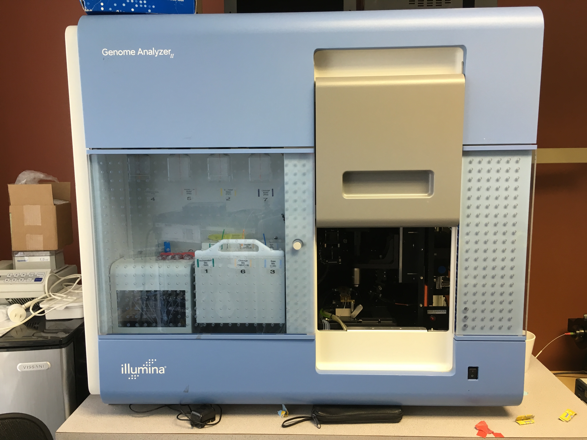{width=500}
:::

:::

:::{.column width="10%"}
:::

:::{.column width="45%"}
:::{.p-img-center}
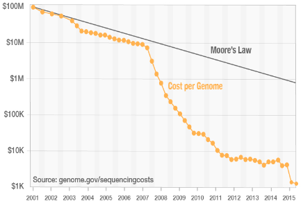{width=500}
:::

:::

::::

:::


:::{.notes}
- The Solexa team sequenced the complete genome of the bacteriophage phiX-174, the same genome Sanger first sequenced using his method

- However, the SBS technology generated significantly more sequencing data, delivering over 3 million bases from a single run.

---

- Solexa acquired instrumentation company Lynx Therapeutics, transforming the successful Solexa prototype into a commercial sequencing instrument: Genome Analyzer

---

- Solexa was acquired by Illumina

- Next-generation sequencing (NGS) data output has increased at a rate that outpaces Moore's law, more than doubling each year
:::


##  {background-image="images/back001.jpg" background-size="cover" background-opacity="0.1"}

[Sequence by synthesis - Process]{.subtit}



::::{.notes}
::: {style="font-size: 9pt"}
**Obiettivo:** Mostrare il processo SBS Illumina con il video ufficiale per consolidare la comprensione visiva.

- Punti chiave da commentare guardando il video:
  1. Bridge amplification: ogni molecola forma un cluster clonale sulla flow cell
  2. Incorporazione di dNTP con terminatore reversibile fluorescente (1 base alla volta)
  3. Imaging con laser: il colore rivela la base incorporata
  4. Rimozione del terminatore → ciclo successivo
- Il processo genera read di 50-300 bp a seconda della chimica
- Paired-end: il frammento viene letto da entrambe le estremità
:::
::::


##  {background-image="images/back001.jpg" background-size="cover" background-opacity="0.1"}

[Third generation NGS]{.subtit}

<br>

:::{.callout-important appearance="default"}
[Third-generation methods allow direct sequencing of single DNA molecules]{style="font-size: 50px; font-family: 'Julius Sans One', sans-serif"}
:::

::::{.notes}
::: {style="font-size: 9pt"}
**Obiettivo:** Introdurre il salto concettuale della terza generazione: niente amplificazione, lettura diretta.

- La differenza chiave: 3a gen legge singole molecole SENZA clonazione/amplificazione
- Vantaggi: read molto lunghi (10-100+ kb), no PCR bias, rilevamento diretto di modificazioni (es. m6A)
- Limitazioni: error rate più alto per singola molecola (ma corretto da coverage)
- Applicazioni RNA-seq: utili per isoform sequencing completo (IsoSeq di PacBio)
:::
::::

##  {background-image="images/back001.jpg" background-size="cover" background-opacity="0.1"}

[Third generation NGS]{.subtit}

<br>

Third-generation NGS platforms:

1. Single-molecule real-time sequencing

1. Nanopore sequencing

:::{.notes}
1. Pacific Biosciences in 2011

1. Oxford Nanopore Technologies on 2014
:::

##  {background-image="images/back001.jpg" background-size="cover" background-opacity="0.1"}

[SMRS]{.subtit}




::::{.notes}
::: {style="font-size: 9pt"}
**Obiettivo:** Illustrare il SMRT sequencing di PacBio con il video.

- SMRT = Single Molecule Real-Time sequencing (Pacific Biosciences, 2011)
- La DNA polimerasi è immobilizzata in una ZMW (zero-mode waveguide): nanocavità che illumina solo la base incorporata
- I colori fluorescenti sui 4 dNTP vengono distinti in tempo reale
- Read length: tipicamente 15-25 kb, fino a >100 kb con HiFi chemistry
- Accuracy: HiFi mode raggiunge >99.9% su singole molecole (CCS reads)
:::
::::

##  {background-image="images/back001.jpg" background-size="cover" background-opacity="0.1"}

[Nanopore sequencing]{.subtit}




::::{.notes}
::: {style="font-size: 9pt"}
**Obiettivo:** Illustrare il nanopore sequencing di Oxford come tecnologia emergente accessibile.

- La molecola di DNA/RNA passa fisicamente attraverso un nanoporo proteico
- Ogni base causa una variazione caratteristica della corrente ionica → sequenza decodificata
- Oxford Nanopore ha MinION: sequenziatore tascabile da ~1000€, connesso via USB!
- Punto forte per RNA-seq: direct RNA sequencing (no conversione a cDNA) → no RT bias
- Adattamento del laboratorio: alcuni studenti potrebbero averlo già usato
:::
::::

##  {background-image="images/back001.jpg" background-size="cover" background-opacity="0.1"}

[Single-Ended vs. Paired-End]{.subtit}

**Choosing Your Sequencing Strategy**

:::{.p-img-center}
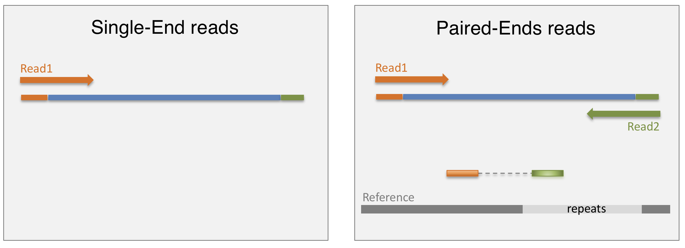{width=1000}
:::

::: {.columns .f30}
::: {.column width="30%"}
*   **Single-end sequencing:**
    *   One read per fragment
    *   Simpler, cost-effective
    *   Suitable for gene expression profiling
:::
::: {.column width="30%"}
*   **Paired-end sequencing:**
    *   Two reads per fragment
    *   More information, improved accuracy
    *   Useful for genome assembly, variant detection, isoform identification
:::
::: {.column width="30%"}
*   **Choice depends on:**
    *   Research question
    *   Budget
    *   Desired accuracy

:::
:::

::::{.notes}
::: {style="font-size: 9pt"}
**Obiettivo:** Illustrare la differenza pratica tra SE e PE e orientare la scelta.

- Single-end (SE): si legge solo un'estremità del frammento → 1 read per frammento
- Paired-end (PE): si leggono entrambe le estremità → 2 read per frammento (con insert size noto)
- Per RNA-seq standard (gene expression): SE 75 bp abbastanza, PE 150 bp lo standard attuale
- PE essenziale per: rilevazione di geni di fusione, splicing alternativo, varianti strutturali
- Il loro laboratorio usa SE o PE? → collegare alla slide successiva con la tabella
:::
::::


##  {background-image="images/back001.jpg" background-size="cover" background-opacity="0.1"}

[Single-Ended vs. Paired-End]{.subtit}

| Trade-off             | Single-End Sequencing | Paired-End Sequencing |
|-----------------------|-----------------------|-----------------------|
| **Cost**              | Lower                 | Higher                |
| **Information**       | Less                  | More                  |
| **Simplicity**        | Simpler               | More Complex          |
| **Accuracy**          | Lower                 | Higher                |
| **Sequencing Depth**  | Higher                | Potentially Lower      |
| **Read Length**       | Shorter               | Longer (effective)    |
| **Ideal Applications** | Gene expression, small RNA-Seq | Genome assembly, variant calling, isoform identification |

::::{.notes}
::: {style="font-size: 9pt"}
**Obiettivo:** Fornire un riferimento comparativo rapido da usare nella pianificazione degli esperimenti.

- Leggere la tabella riga per riga commentando le trade-off più importanti
- Cost: PE costa ~1.5-2x di SE per lo stesso numero di campioni
- Information: PE dà informazione sulla lunghezza dell'inserto → QC della libreria incluso
- Raccomandazione pratica: per bulk RNA-seq gene expression usate PE 150bp come standard
- Domanda: nel loro laboratorio, qual'è la scelta default del centro di sequenziamento?
:::
::::


##  {background-image="images/back001.jpg" background-size="cover" background-opacity="0.1"}

[Sequencing Depth]{.subtit}

**Sequencing Depth: Finding the Right Balance**

:::{.p-img-center}
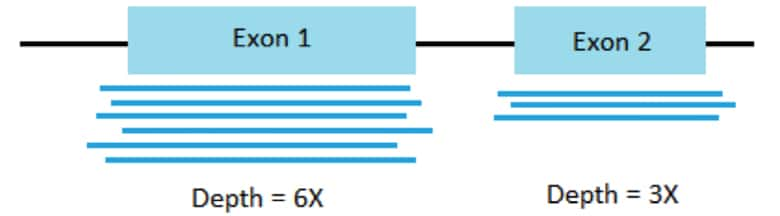
:::

::: {.columns .f25}
::: {.column width="33%"}
*   **What it is:** The average number of times each base in the genome (or transcriptome) is sequenced.
*   **Why it matters:**
    *   **Sensitivity:** Higher depth increases the chance of detecting rare transcripts or variants.
    *   **Accuracy:**  Higher depth improves the accuracy of gene expression quantification and variant calling.
:::
::: {.column width="33%"}
*   **Factors to consider:**
    *   **Research goals:**  Higher depth is needed for detecting rare events or subtle changes.
    *   **Genome size and complexity:** Larger genomes require higher depth for adequate coverage.
    *   **Budget:**  Higher depth increases sequencing costs.
:::
::: {.column width="33%"}
*   **Typical ranges:**
    *   RNA-Seq for gene expression: 10-30 million reads per sample
    *   RNA-Seq for isoform detection: 30-60 million reads per sample
    *   Variant calling: 30-50x coverage for whole-genome sequencing

:::
:::

::::{.notes}
::: {style="font-size: 9pt"}
**Obiettivo:** Spiegare il concetto di profondità di sequenziamento e guidare la scelta corretta.

- Depth = numero medio di volte che ogni base trascriptoma è letta
- Per gene expression bulk RNA-seq umano: 20-30M reads sufficiente; con pochi geni target anche 10M
- Per trascrittomi complessi (es. piante con alto contenuto tandem repeats): servono più reads
- Il punto chiave dalla slide precedente (Liu et al.): depth < n replicati per importanza
- Budget: calcolare (costo per campione) × n → qual è il trade-off ottimale?
:::
::::


##  {background-image="images/back001.jpg" background-size="cover" background-opacity="0.1"}

[Transcriptome Coverage]{.subtit}

**Transcriptome Coverage: Capturing the Full Picture**

:::{.p-img-center}
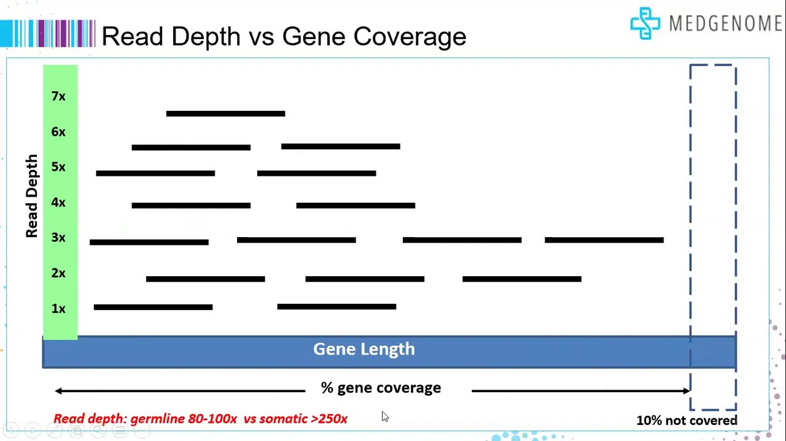{width=400}
:::


::: {.columns .f25}
::: {.column width="50%"}
*   **What it is:** The extent to which the sequencing reads represent the entire transcriptome.
*   **Why it matters:**
    *   **Completeness:**  High coverage ensures that all expressed transcripts are captured, including rare and low-abundance transcripts.
    *   **Accuracy:**  Adequate coverage is needed for accurate quantification of gene expression levels.
    *   **Discovery:**  High coverage increases the chances of identifying novel transcripts and isoforms.
:::
::: {.column width="50%"}
*   **Factors influencing coverage:**
    *   **Sequencing depth:** Higher depth generally leads to better coverage.
    *   **Library complexity:** A diverse library with a wide range of fragment sizes improves coverage.
    *   **RNA integrity:** High-quality RNA ensures that all transcripts are represented in the library.
    *   **Sequencing technology:**  Different platforms have different read lengths and biases, which can affect coverage.
:::
:::

::::{.notes}
::: {style="font-size: 9pt"}
**Obiettivo:** Distinguere coverage (copertura) da depth (profondità) e spiegare i fattori che la influenzano.

- Coverage ≠ depth: depth è la profondità media, coverage è la proporzione del trascrittoma coperta
- Un trascrittoma può avere alta depth ma bassa coverage se le reads si concentrano su pochi geni molto espressi
- RNA di alta qualità (alto RIN) → distribuzione uniforme dei read lungo il trascritto
- RNA degradato → bias 3' (più reads sul 3' end) → coverage distorta
- Tool per valutare la coverage: RSeQC, infer_experiment.py
:::
::::


#  {background-image="images/back001.jpg" background-size="cover" background-opacity="0.1"}


[Emerging Trends and Future Directions]{.tit .p-span-center}

::::{.notes}
::: {style="font-size: 9pt"}
**Obiettivo:** Aprire la panoramica sulle frontiere attuali della trascrittomica oltre il bulk RNA-seq.

- Il bulk RNA-seq misura la media di espressione su milioni di cellule → perde l'eterogeneità cellulare
- Tre trend principali: scRNA-seq (risoluzione cellulare singola), spatial (risoluzione spaziale), multi-omics
- Questi metodi sono complementari al bulk: prima bulk per overview, poi single-cell per dettaglio
- Menzionare che questi metodi sono computazionalmente più costosi e richiedono più campioni
:::
::::


##  {background-image="images/back001.jpg" background-size="cover" background-opacity="0.1"}

[Single-Cell RNA Sequencing]{.subtit}

**Zooming In: Analyze gene expression in individual cells**

:::{.p-img-center}
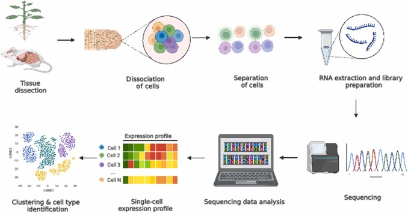{width=1200}
:::

<!-- ::: {.columns}
::: {.column width="50%"}
*   **Advantages:**
    *   Cellular heterogeneity
    *   Cell-fate transitions
    *   Rare cell populations
:::
::: {.column width="50%"}
*   **Challenges:**
    *   Technical complexity
    *   Cost
    *   Data analysis
:::
::: -->

::::{.notes}
::: {style="font-size: 9pt"}
**Obiettivo:** Introdurre visivamente il concetto di single-cell RNA-seq e la sua risoluzione.

- L'immagine mostra UMAP o t-SNE: ogni punto è una singola cellula, colorata per tipo cellulare
- Il bulk RNA-seq vede la media di tutto; scRNA-seq vede ogni cellula individualmente
- Applicazione emblematica: in un tumore, cellule tumorali + immunitarie + stromali coesistono → bulk fa la media di tutto
- Costo: 5-10x quello del bulk per campione, ma informazione incomparabilmente maggiore
:::
::::

##  {background-image="images/back001.jpg" background-size="cover" background-opacity="0.1"}

[Single-Cell RNA Sequencing]{.subtit}

**scRNA-Seq: advantages in biological research**

*   **Cellular Heterogeneity:**  Identify and characterize different cell types within a complex tissue or population.
    *   Discover new cell subtypes and rare cell populations.
    *   Understand the functional diversity of cells.
*   **Developmental Trajectories:**  Trace cell lineages and reconstruct developmental pathways.
    *   Study cell differentiation and fate decisions.
    *   Identify key genes and regulatory networks involved in development.

::::{.notes}
::: {style="font-size: 9pt"}
**Obiettivo:** Illustrare i vantaggi nel caratterizzare popolazioni cellulari eterogenee e traiettorie di sviluppo.

- Eterogeneità cellulare: identificare sottopopolazioni rare (<1% delle cellule) invisibili al bulk
- Esempio: cellule staminali tumorali, responsabili della resistenza ai farmaci, sono una piccola frazione
- Traiettorie (pseudotime): ricostruire l'ordine temporale di differenziamento senza sincronizzare le cellule
- Tool: Seurat, Scanpy per analisi; Monocle, RNA velocity per traiettorie
:::
::::


##  {background-image="images/back001.jpg" background-size="cover" background-opacity="0.1"}

[Single-Cell RNA Sequencing]{.subtit}

**scRNA-Seq: advantages in biological research**

*   **Disease Mechanisms:**  Investigate the cellular basis of disease.
    *   Identify disease-associated cell types and gene expression changes.
    *   Study the response of individual cells to drugs or treatments.


:::{.callout-important appearance="default"}
scRNA-seq represents a powerful tool for dissecting the complexities of gene expression and cellular heterogeneity across various biological contexts
:::

::::{.notes}
::: {style="font-size: 9pt"}
**Obiettivo:** Completare i vantaggi dello scRNA-seq con le applicazioni in patologia.

- Meccanismi di malattia: identificare il tipo cellulare specifico che guida la patologia
- Resistenza ai farmaci: cellule che evadono la terapia hanno profili trascrizionali diversi
- Composizione cellulare del microambiente tumorale: fondamentale per immunoterapia
- Limiti pratici: richiede cellule vive (o nuclei), protocollo di dissociazione critico, costo elevato
:::
::::


##  {background-image="images/back001.jpg" background-size="cover" background-opacity="0.1"}

[Spatial Transcriptomics]{.subtit}

**Spatial Transcriptomics: mapping gene expression in context**

::: {.columns}
::: {.column width="40%"}
<br>
<br>

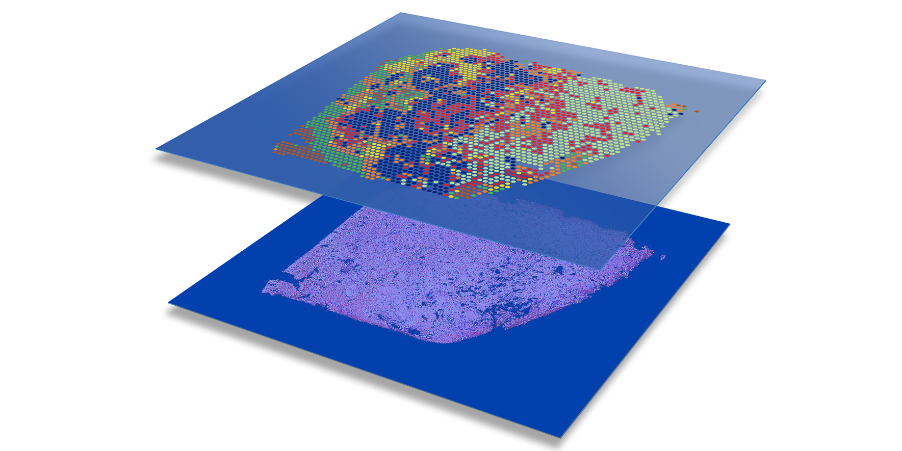{width=600}

:::
::: {.column width="60%" .f30}
*   **Bridges histology and genomics:** Combines traditional tissue imaging with high-throughput RNA sequencing.
*   **Preserves spatial context:**  Maps gene expression while retaining spatial information, unlike traditional scRNA-seq.
*   **Enables:**
    *   Visualization of gene expression patterns within tissues.
    *   Quantitative analysis of transcriptomes in a spatial context.
*   **Applications:**
    *   Understanding tissue organization and cellular interactions.
    *   Investigating developmental processes (organogenesis).
    *   Studying disease progression and heterogeneity.

:::
:::

::::{.notes}
::: {style="font-size: 9pt"}
**Obiettivo:** Introdurre la spatial transcriptomics come ponte tra istologia e genomica.

- Problema del scRNA-seq: perdiamo l'informazione sulla posizione delle cellule nel tessuto
- Spatial transcriptomics risolve questo: misura l'espressione genica mantenendo le coordinate spaziali
- Tecnologie: 10x Visium (spot array, ~55μm), Slide-seq (single cell resolution), MERFISH, seqFISH
- Applicazione emblematica: geni espressi diversamente nel centro vs periferia di un tumore
:::
::::


##  {background-image="images/back001.jpg" background-size="cover" background-opacity="0.1"}

[Spatial Transcriptomics]{.subtit}


**Spatial Transcriptomics: from technology to discovery**

::: {.columns}
::: {.column width="40%"}
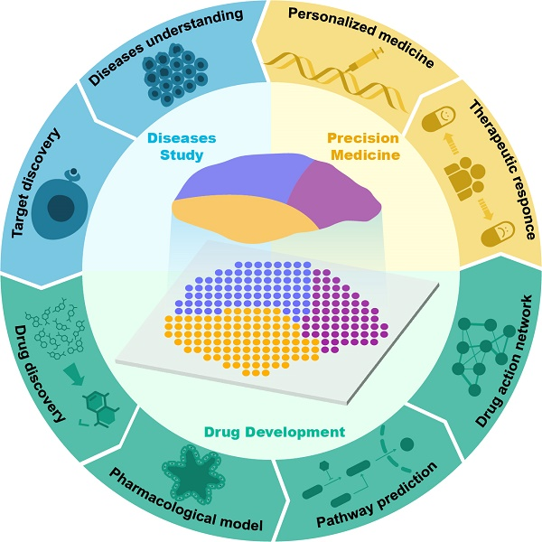{width=600}
:::
::: {.column width="60%" .f30}
*   **Applications:**
    *   **Tissue heterogeneity:**  Studying complex tissues like the cochlea. (Tisi, 2023)
    *   **Disease mechanisms:**  Uncovering cellular dynamics in diseases like Alzheimer's. (Chen et al., 2020)
*   **Data analysis:**
    *   Dimension reduction, deconvolution, and integration with histological images.
    *   Specialized tools for cell type deconvolution. (Cable et al., 2021)

:::
:::

::::{.notes}
::: {style="font-size: 9pt"}
**Obiettivo:** Mostrare applicazioni concrete della spatial transcriptomics su tessuti biologici complessi.

- Esempio coclea (Tisi 2023): tessuto altamente specializzato con tipi cellulari rarissimi → solo spatial li identifica in situ
- Esempio Alzheimer (Chen 2020): regioni cerebrali colpite diversamente, spatial mostra la progressione spaziale
- Deconvoluzione: ogni spot Visium contiene più cellule → algoritmi (RCTD, SPOTlight) inferiscono composizione
- Analisi: dimension reduction con PCA/UMAP, integrazione con immagine H&E
:::
::::


##  {background-image="images/back001.jpg" background-size="cover" background-opacity="0.1"}

[Integration of RNA-Seq with other omics data]{.subtit}

**Beyond RNA: integrating with other omics data**

::: {.f30}
*   **The Power of Integration:** Combining RNA-Seq with other omics data provides a more complete picture of cellular processes.
    *   **Metabolomics:**  Correlate gene expression with metabolic pathways and identify key metabolites.
    *   **Chromatin accessibility (ATAC-seq):**  Link gene expression changes to alterations in chromatin structure.
    *   **Other omics layers:**  Integrate with genomics, proteomics, and epigenomics for a systems-level understanding.
*   **Key Findings:**
    *   Limited overlap between DEGs and chromatin accessibility changes (~10%) (Malvi et al., 2022).
    *   Highlights the complexity of gene regulation beyond chromatin state. (Miao et al., 2021)
:::

::::{.notes}
::: {style="font-size: 9pt"}
**Obiettivo:** Motivare l'integrazione multi-omics come approccio necessario per la biologia dei sistemi.

- Nessun singolo strato omico racconta la storia completa
- RNA-seq + metabolomica: correlazione tra trascritti e metaboliti → pathway analysis integrata
- RNA-seq + ATAC-seq: solo ~10% dei geni DE ha cambiamenti corrispondenti nella cromatina accessibile
- Questo dimostra che la regolazione trascrizionale è più complessa dell'apertura/chiusura della cromatina
- Sfida principale: integrazione computazionale di dati con scale, dimensioni e rumore diversi
:::
::::

##  {background-image="images/back001.jpg" background-size="cover" background-opacity="0.1"}

[Integration of RNA-Seq with other omics data]{.subtit}

**Unlocking biological insights through data integration**

::: {.columns}
::: {.column width="40%"}
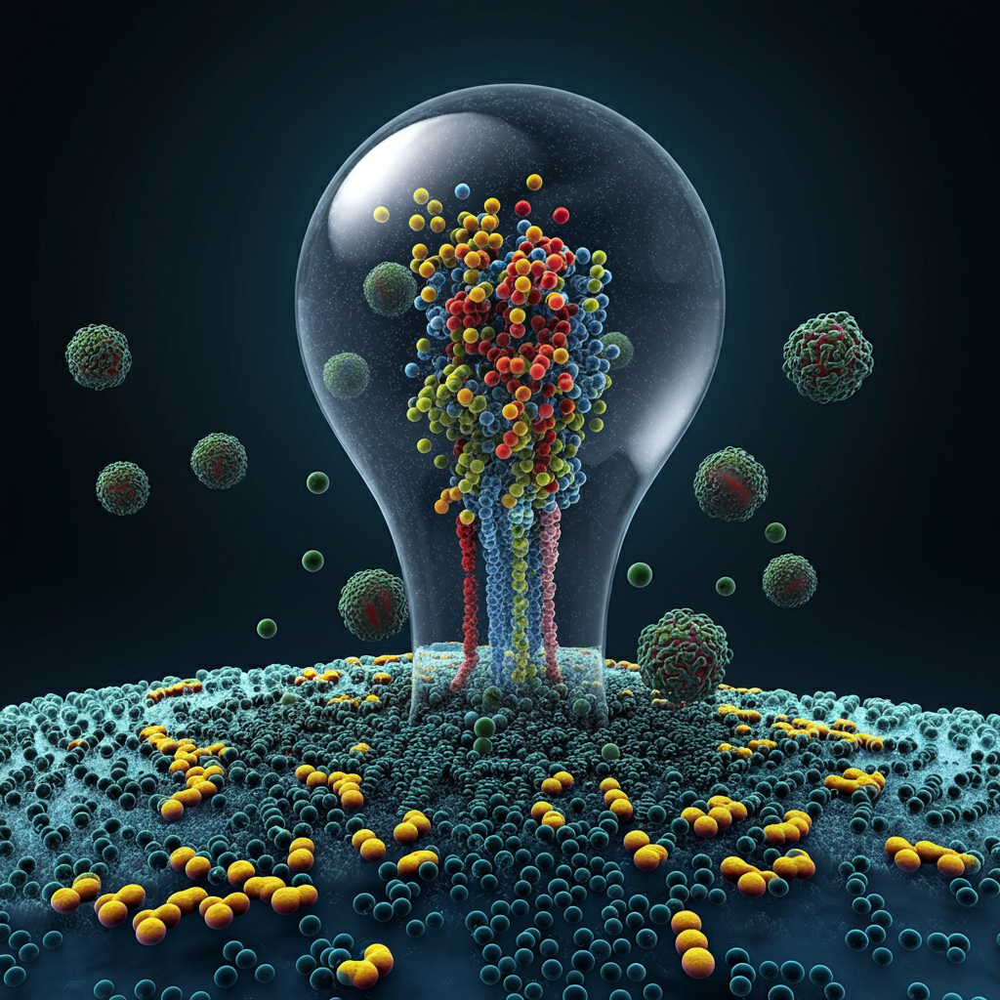{width=500}
:::
::: {.column width="60%" .f25}
*   **Applications:**
    *   **Identifying key pathways:**  Integration of RNA-seq and metabolomics reveals regulated pathways in liver metabolism. (Zhang et al., 2020)
    *   **Disease biomarkers:**  Uncovering disease-specific biomarkers in NAFLD using RNA-seq and metabolomics. (Ji et al., 2022)
*   **Tools and Techniques:**
    *   **Machine learning:**  rSeqTU for predicting transcription units and integrating with metagenomics and metabolomics. (Hou et al., 2022)
    *   **Statistical analysis:**  DESeq2 for integrating RNA-seq and ChIP-seq data. (Niu et al., 2019)
    *   **Single-cell multi-omics:**  Combining scRNA-seq with lipidomics and metabolomics to study cellular heterogeneity. (Cao et al., 2020)

:::
:::

::::{.notes}
::: {style="font-size: 9pt"}
**Obiettivo:** Mostrare gli strumenti e le applicazioni concrete dell'integrazione multi-omics.

- Machine learning (rSeqTU): predizione di unità trascrizionali integrando metagenomics + metabolomics
- DESeq2 può essere usato anche per integrare ChIP-seq con RNA-seq (stessa struttura dati)
- Single-cell multi-omics: CITE-seq (proteina + RNA), ATAC+RNA in singola cellula
- Sfida computazionale: ogni strato ha dimensioni diverse → serve riduzione dimensionale e matching di cellule
- Il campo è in rapida evoluzione: nuovi workflow ogni mese
:::
::::


#  {background-image="images/qmark.jpg" background-size="cover" background-opacity="0.7"}


::: {style="position: absolute; left: 980px; top: 450px;"}
[Domande?]{style="font-size: 130px; font-weight: bold; color: white"}
:::

