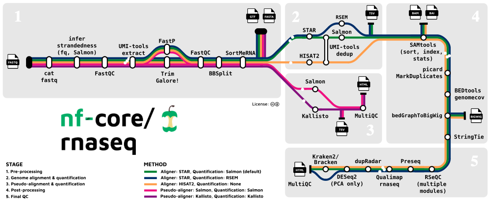

##  {#TitleSlide data-menu-title="TitleSlide" background-image="images/back001.jpg" background-size="cover" background-opacity="0.3"}

```{r setup, include=FALSE}
library(fontawesome)
library(tidyverse)
library(quarto)
```

::: {style="position: absolute; left: 180px; top: 200px; height: 525px; width: 1500px; background-color: #69b1e9; padding: 20px; padding-left: 50px; border-radius: 5px;"}
[Pipeline di Analisi: nf-core/rnaseq]{style="font-size: 80px; font-weight: bold; line-height: 1em; margin: 0px;"}

[Dalla QC alla Quantificazione]{style="font-size: 40px;font-weight: bold;"}

<br> <br>

[Analisi Bulk RNA-Seq per Dottorandi]{style="font-size: 40px; font-weight: bold;"}
:::

#  {background-image="images/back001.jpg" background-size="cover" background-opacity="0.1"}

[Perché una Pipeline?]{.tit .p-span-center}

##  {background-image="images/back001.jpg" background-size="cover" background-opacity="0.1"}

[Riproducibilità e Scalabilità]{.subtit}

:::: {.columns}
::: {.column width="50%" .f30}
**La sfida dell'analisi manuale:**
- Installazione complessa di software.
- Versioni conflittuali.
- Difficile tenere traccia di parametri e passaggi.
- Impossibile da riprodurre su un altro computer.
:::

::: {.column width="50%" .f30}
**La soluzione: Nextflow + nf-core:**
- **Portabilità**: Esegue ovunque (laptop, cluster, cloud).
- **Container**: Ogni step usa Docker/Singularity (software pre-installato).
- **Standardizzazione**: Pipeline curate dalla community bioinformatica.
:::
::::

#  {background-image="images/back001.jpg" background-size="cover" background-opacity="0.1"}

:::{.p-img-center}
{width=1500}
:::

[La Pipeline Standard De-Facto]{.p-span-center .f40}

##  {background-image="images/back001.jpg" background-size="cover" background-opacity="0.1"}

[Workflow Overview]{.subtit}

:::{.p-img-center}
{width=1800}
:::
<!-- Note: Ensure metro_map.png is available in images folder or replace with a mermaid diagram if preferable -->

##  {background-image="images/back001.jpg" background-size="cover" background-opacity="0.1"}

[Input della Pipeline]{.subtit}

### Il Samplesheet

Il punto di ingresso è un file CSV che descrive i campioni:

```csv
sample,fastq_1,fastq_2,strandedness
CONTROL_REP1,AEG588A1_S1_L002_R1_001.fastq.gz,AEG588A1_S1_L002_R2_001.fastq.gz,auto
CONTROL_REP2,AEG588A1_S2_L002_R1_001.fastq.gz,AEG588A1_S2_L002_R2_001.fastq.gz,auto
TREAT_REP1,AEG588A1_S3_L002_R1_001.fastq.gz,AEG588A1_S3_L002_R2_001.fastq.gz,auto
```

::: {.callout-note}
**Strandedness**: `auto` permette alla pipeline di inferire automaticamente la strandness del protocollo (es. dUTP, unstranded).
:::

#  {background-image="images/back001.jpg" background-size="cover" background-opacity="0.1"}

[Step 1: Raw QC & Trimming]{.tit .p-span-center}

##  {background-image="images/back001.jpg" background-size="cover" background-opacity="0.1"}

[Preprocessing]{.subtit}

### FastQC + Trim Galore! / FastP

La pipeline esegue automaticamente:
1.  **FastQC**: Analisi qualità preliminare.
2.  **Trimming**: Rimozione adattatori e basi a bassa qualità.
    -   *Trim Galore!* (default) o *FastP*.
3.  **Removal rRNA**: Opzionale (`--remove_ribo_rna`), utile se la deplezione in laboratorio non è stata perfetta.

#  {background-image="images/back001.jpg" background-size="cover" background-opacity="0.1"}

[Step 2: Allineamento e Quantificazione]{.tit .p-span-center}

##  {background-image="images/back001.jpg" background-size="cover" background-opacity="0.1"}

[Due Strategie Principali]{.subtit}

:::: {.columns}
::: {.column width="50%" .f30}
### 1. Allineamento Classico (STAR)

-   Mappa le reads sul genoma di riferimento.
-   Produce file BAM (visualizzabili su IGV).
-   Quantificazione gene-level via **Salmon** o **featureCounts**.
-   **Pro**: Permette di vedere le reads, scoprire nuovi trascritti.
-   **Contro**: Lento, file pesanti.
:::

::: {.column width="50%" .f30}
### 2. Pseudo-allineamento (Salmon/Kallisto)

-   Mappa le reads sul *trascrittoma*.
-   Non produce BAM (niente coordinate genomiche).
-   Stima abbondanza trascritti velocemente.
-   **Pro**: Velocissimo, accurato per la quantificazione.
-   **Contro**: Meno utile per QC visuale (IGV).
:::
::::

##  {background-image="images/back001.jpg" background-size="cover" background-opacity="0.1"}

[Salmon: Quasi-mapping]{.subtit}

La pipeline usa **Salmon** come standard per la quantificazione (sia in mode pseudo-alignment che alignment-based).

1.  **Index**: Costruisce un indice del trascrittoma.
2.  **Quant**: Stima l'espressione (TPM, NumReads).
3.  **Bias Correction**: Corregge bias di sequenziamento (GC content, posizione).

Output principale: `quant.sf` per ogni campione.

#  {background-image="images/back001.jpg" background-size="cover" background-opacity="0.1"}

[Step 3: Quality Control Finale]{.tit .p-span-center}

##  {background-image="images/back001.jpg" background-size="cover" background-opacity="0.1"}

[MultiQC]{.subtit}

Un singolo report HTML che aggrega i risultati di tutti gli step e tutti i campioni.

:::: {.columns}
::: {.column width="60%" .f25}
**Cosa controllare:**
-   **General Stats**: Quante reads sono sopravvissute al trimming?
-   **Alignment Score**: % di reads allineate univocamente (ideale > 80%).
-   **Complexity**: Duplicati PCR.
-   **Strand Check**: Conferma del protocollo di libreria.
:::
::: {.column width="40%"}
:::{.p-img-center}
{width=400}
:::
:::
::::

#  {background-image="images/back001.jpg" background-size="cover" background-opacity="0.1"}

[Eseguire la Pipeline]{.tit .p-span-center}

##  {background-image="images/back001.jpg" background-size="cover" background-opacity="0.1"}

[Il Comando Magico]{.subtit}

```bash
nextflow run nf-core/rnaseq \
    --input samplesheet.csv \
    --outdir ./results \
    --genome GRCh38 \
    -profile docker
```

-   `--input`: Il file CSV creato prima.
-   `--genome`: Il genoma di riferimento (es. Umano GRCh38). Nextflow scarica indici e annotazioni automaticamente da AWS iGenomes.
-   `-profile docker`: Usa Docker per gestire le dipendenze.

##  {background-image="images/back001.jpg" background-size="cover" background-opacity="0.1"}

[Risultati: Output Folder]{.subtit}

```text
results/
├── multiqc/
│   └── multiqc_report.html  <-- START HERE
├── star_salmon/
│   ├── salmon.merged.gene_counts.tsv
│   ├── salmon.merged.gene_tpm.tsv
│   └── ...
├── pipeline_info/
└── ...
```

I file `salmon.merged.gene_counts.tsv` sono pronti per essere importati in R per l'analisi differenziale!

#  {background-image="images/qmark.jpg" background-size="cover" background-opacity="0.7"}

::: {style="position: absolute; left: 980px; top: 450px;"}
[Lab Time!]{style="font-size: 130px; font-weight: bold; color: white"}
:::

