##  {#TitleSlide data-menu-title="TitleSlide" background-image="images/back001.jpg" background-size="cover" background-opacity="0.3"}

```{r setup, include=FALSE}
library(fontawesome)
library(tidyverse)
library(quarto)
library(gt)
library(gtExtras)
library(gtsummary)

# font-family: 'Architects Daughter', cursive;
# font-family: 'Julius Sans One', sans-serif;
# font-family: 'Montserrat', san  s-serif;
# font-family: 'Rock Salt', cursive;
```

<style>
  @import url('https://fonts.googleapis.com/css2?family=Architects+Daughter&family=Julius+Sans+One&family=Montserrat:wght@300&family=Rock+Salt&display=swap');
</style>

::: {style="position: absolute; left: 180px; top: 200px; height: 525px; width: 1500px; background-color: #69b1e9; padding: 20px; padding-left: 50px; border-radius: 5px;"}
[Introduzione all'RNASeq]{style="font-size: 120px; font-weight: bold; line-height: 1em; margin: 0px; font-family: 'Architects Daughter', cursive;"}

[Introduzione all'analisi RNASeq in R]{style="font-size: 40px;font-weight: bold;"}

[Dipartimento di Biomedicina e Prevenzione]{style="font-size: 40px;font-weight: bold;"}

<br> <br>

[Marco Chiapello, Revelo Datalab]{style="font-size: 40px; font-weight: bold;"}

[Nomber 2024]{style="font-size: 30px;font-weight: bold;"}
:::

::::{.notes}
::: {style="font-size: 9pt"}
**Obiettivo:** Introdurre il modulo sulla pipeline nf-core/rnaseq e creare il contesto per la giornata.

- Benvenuti a questo modulo dedicato alla **pipeline nf-core/rnaseq**: impareremo come trasformare i dati grezzi di sequenziamento in risultati biologicamente interpretabili
- Oggi vedremo l'intera catena analitica, dal controllo qualità delle reads grezze fino alla quantificazione dell'espressione genica
- **nf-core** è una raccolta di workflow bioinformatici standardizzati, sviluppati dalla comunità e basati sul framework **Nextflow**
- L'obiettivo non è memorizzare ogni comando: vogliamo capire **perché** ogni step esiste e cosa fa al vostro campione
:::
::::


<!-- #  {background-image="images/back001.jpg" background-size="cover" background-opacity="0.1"}

[Overview]{.f60 .p-span-center}

:::{.p-img-center}
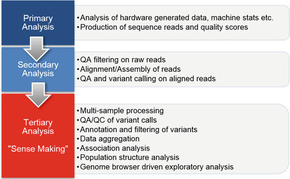{width=1000}
::: -->

#  {background-image="images/back001.jpg" background-size="cover" background-opacity="0.1"}

:::{.p-img-center}
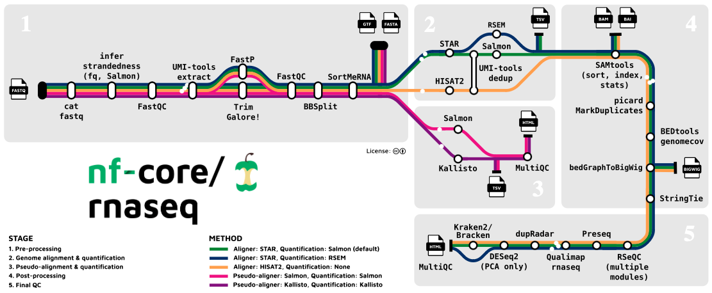{width=2000}
:::

::::{.notes}
::: {style="font-size: 9pt"}
**Obiettivo:** Orientare gli studenti nel diagramma complessivo della pipeline prima di entrare nei dettagli.

- Questa immagine mostra l'intera pipeline nf-core/rnaseq: ogni blocco colorato rappresenta uno step, ogni freccia il flusso dei dati
- Nei prossimi moduli analizzeremo ogni sezione nel dettaglio — oggi partiamo dal pre-processing e dal controllo qualità
:::
::::

#  {background-image="images/back001.jpg" background-size="cover" background-opacity="0.1"}

[Pre-processing and Quality Control]{.tit .p-span-center}

::::{.notes}
::: {style="font-size: 9pt"}
**Obiettivo:** Contestualizzare la sezione di pre-processing e QC come fondamento imprescindibile per l'analisi.

- Prima di qualsiasi analisi dobbiamo garantire che i dati di partenza siano di qualità sufficiente: **garbage in, garbage out**
- Questa sezione copre il **controllo qualità delle reads grezze**, il **trimming degli adattatori** e la **rimozione di contaminanti**
- Se saltiamo questi step rischiamo di fare analisi su dati corrotti, invalidando tutti i risultati a valle
:::
::::

##  {background-image="images/back001.jpg" background-size="cover" background-opacity="0.1"}

:::{.p-img-center}
{width=2000}
:::

::::{.notes}
::: {style="font-size: 9pt"}
Qui vediamo evidenziata la porzione della pipeline relativa al pre-processing: nelle slide successive analizzeremo uno per uno i blocchi colorati in questa regione.
:::
::::

##  {background-image="images/back001.jpg" background-size="cover" background-opacity="0.1"}

[Raw reads: The Starting Point]{.subtit}

### FASTA file

::: {.callout-important icon="false"}
## Definition

The FASTA format is a text-based format for representing either nucleotide sequences or amino acid sequences. Both nucleotides and amino acids are represented using single-letter codes. The first line before the nucleotide/amino acid sequence contains the name of the sequence, preceded by the ">" symbol.
:::

File extension could be: fasta, fna, ffn, faa, fa, frn

::::{.notes}
::: {style="font-size: 9pt"}
**Obiettivo:** Fare in modo che gli studenti riconoscano il formato FASTA come punto di partenza per i dati genomici di riferimento.

- Il formato **FASTA** è il più semplice per rappresentare sequenze biologiche: ogni sequenza ha un header che inizia con `>` seguito dall'identificatore
- È usato per **genomi di riferimento**, trascrittomi e database di sequenze proteiche
- Le estensioni multiple (`.fa`, `.fna`, `.faa`, ecc.) identificano il tipo di molecola ma il formato interno è identico
- Conoscere FASTA è essenziale: il genoma/trascrittoma di riferimento che useremo nella pipeline è in questo formato
:::
::::

##  {background-image="images/back001.jpg" background-size="cover" background-opacity="0.1"}

[Raw reads: The Starting Point]{.subtit}

### FASTA file

::: {.callout-important icon="false"}
## Definition

The FASTA format is a text-based format for representing either nucleotide sequences or amino acid sequences. Both nucleotides and amino acids are represented using single-letter codes. The first line before the nucleotide/amino acid sequence contains the name of the sequence, preceded by the ">" symbol.
:::

    >NM_001404729.1 Oryza sativa ribulose bisphosphate carboxylase small chain A
    CTCAACAGCACTGCTACTGGACATACTCTACTACTACTAGCCAGTAAGCTAGCTAACTAACTACGTGGCT
    ATGGCCCCCACCGTGATGGCCTCCTCGGCCACCTCCGTGGCTCCATTCCAAGGGCTCAANNNNNNNNNNN

::::{.notes}
::: {style="font-size: 9pt"}
**Obiettivo:** Leggere concretamente un record FASTA e capire la struttura header + sequenza.

- La prima riga è l'**header**: `NM_001404729.1` è l'accession NCBI, seguita dalla descrizione dell'organismo e del gene
- Le righe successive contengono la **sequenza nucleotidica**, spezzata in righe da 60-80 caratteri per leggibilità
- Le `N` consecutive indicano regioni **non assemblate o mascherate** nel genoma di riferimento
- Ogni record FASTA termina quando inizia un nuovo `>` oppure alla fine del file
:::
::::


##  {background-image="images/back001.jpg" background-size="cover" background-opacity="0.1"}

[Raw reads: The Starting Point]{.subtit}

### FASTA file

Multi-fasta file:

    >MCHU - Calmodulin - Human, rabbit, bovine, rat, and chicken
    MADQLTEEQIAEFKEAFSLFDKDGDGTITTKELGTVMRSLGQNPTEAELQDMINEVDADGNGTID
    FPEFLTMMARKMKDTDSEEEIREAFRVFDKDGNGYISAAELRHVMTNLGEKLTDEEVDEMIREA
    DIDGDGQVNYEEFVQMMTAK

    >NM_001404729.1 Oryza sativa ribulose bisphosphate carboxylase small chain A
    CTCAACAGCACTGCTACTGGACATACTCTACTACTACTAGCCAGTAAGCTAGCTAACTAACTACGTGGCT
    ATGGCCCCCACCGTGATGGCCTCCTCGGCCACCTCCGTGGCTCCATTCCAAGGGCTCAANNNNNNNNNNN
    >HF583486.1 Homo sapiens SOD1 gene for alternative protein SOD1, isolate 144496
    ATGGATTCCATGTTCATGAGTTTGGAGATAATACAGCAGGCTGTACCAGTGCAGGTCCTCACTTTAATCC
    TCTATCCAGAAAACACGGTGGGCCAAAGGATGAAGAGAGGCATGTTGGAGACTTGGGCAATGTGA

::::{.notes}
::: {style="font-size: 9pt"}
**Obiettivo:** Spiegare il concetto di multi-FASTA e il suo utilizzo nel contesto RNA-seq con Salmon.

- Un file **multi-FASTA** contiene centinaia di migliaia di sequenze in un unico file, ognuna preceduta dal proprio `>`
- Il **trascrittoma di riferimento** che useremo con Salmon è un multi-FASTA con tutti i trascritti umani annotati (es. GENCODE v43: ~250.000 trascritti)
- La dimensione di questi file è considerevole: il genoma umano GRCh38 in FASTA è circa 3 GB
- Tenete a mente questa struttura: quando Salmon costruirà l'indice di allineamento, partirà esattamente da questo tipo di file
:::
::::


##  {background-image="images/back001.jpg" background-size="cover" background-opacity="0.1"}

[Raw reads: The Starting Point]{.subtit}

### FASTQ format

::: {.callout-important icon="false"}
## Definition

The FASTQ format is a text-based format for storing both a biological sequence (usually nucleotide sequence) and its corresponding quality scores. Both the sequence letter and quality score are each encoded with a single ASCII character for brevity.   
:::

::::{.notes}
::: {style="font-size: 9pt"}
**Obiettivo:** Introdurre il formato FASTQ come estensione del FASTA con l'aggiunta dell'informazione qualitativa.

- Il **FASTQ** è il formato standard prodotto dai sequenziatori Illumina: è ciò che riceverete dal core facility dopo il sequenziamento
- La novità rispetto al FASTA è il **quality score**: per ogni nucleotide c'è un carattere che ne codifica l'affidabilità di lettura
- Questi score di qualità sono fondamentali per capire quanto fidarsi di ogni base sequenziata
- Senza questa informazione non potremmo fare un controllo qualità significativo dei nostri dati grezzi
:::
::::

##  {background-image="images/back001.jpg" background-size="cover" background-opacity="0.1"}

[Raw reads: The Starting Point]{.subtit}

### FASTQ format

::: {.callout-important icon="false"}
## Definition

The FASTQ format is a text-based format for storing both a biological sequence (usually nucleotide sequence) and its corresponding quality scores. Both the sequence letter and quality score are each encoded with a single ASCII character for brevity.   
:::

::: f30
A FASTQ file is identified by 4 lines:

- Line 1: begins with the "@" symbol and is followed by the sequence identifier (as in FASTA sequences)    
- Line 2: contains the nucleotide sequence    
- Line 3: begins with a "+" and may contain additional sequence descriptions    
- Line 4: contains the quality values for the individual nucleotides
:::

::::{.notes}
::: {style="font-size: 9pt"}
**Obiettivo:** Memorizzare la struttura a 4 righe del formato FASTQ e il ruolo di ciascuna riga.

- **Riga 1 (@ID)**: identificatore unico della read, contiene informazioni sullo strumento e sulla corsa di sequenziamento
- **Riga 2 (sequenza)**: la sequenza nucleotidica grezza rilevata dal sequenziatore, una base per carattere
- **Riga 3 (+)**: separatore storico — oggi è quasi sempre solo `+`, ma può ripetere l'ID per compatibilità
- **Riga 4 (quality)**: stringa di caratteri ASCII che codificano il Phred score, deve avere **esattamente la stessa lunghezza** della riga 2
:::
::::

##  {background-image="images/back001.jpg" background-size="cover" background-opacity="0.1"}

[Raw reads: The Starting Point]{.subtit}

### FASTQ format

::: {.callout-important icon="false"}
## Definition
The FASTQ format is a text-based format for storing both a biological sequence (usually nucleotide sequence) and its corresponding quality scores. Both the sequence letter and quality score are each encoded with a single ASCII character for brevity.   

:::

::: f35
    @SEQ_ID
    GATTTGGGGTTCAAAGCAGTATCGATCAAATAGTAAATCCATTTGTTCAACTCACAGTTT
    +
    !''*((((***+))%%%++)(%%%%).1***-+*''))**55CCF>>>>>>CCCCCCC65
:::

::::{.notes}
::: {style="font-size: 9pt"}
**Obiettivo:** Leggere un'entry FASTQ reale e interpretare i caratteri di qualità come Phred score.

- `@SEQ_ID` è l'identificatore della read — nei file reali troveremo qualcosa come `@SRR1039508.1 1 length=63`
- La stringa di qualità `!''*((((***+))...` sembra incomprensibile, ma ogni carattere è un **valore ASCII** che codifica il Phred score
- Il carattere `!` (ASCII 33 − 33 = **Q0**) indica una base quasi certamente errata; `F` (ASCII 70 − 33 = **Q37**) indica una base molto affidabile
- Notate le variazioni lungo la sequenza: le basi alle estremità tendono ad avere qualità più bassa — per questo il trimming è necessario
:::
::::

##  {background-image="images/back001.jpg" background-size="cover" background-opacity="0.1"}

[Raw reads: The Starting Point]{.subtit}

### FASTQ format

#### What does "quality score" mean?

::: f20
The quality score is used to identify the **probability of the correct identification of the corresponding nucleotide**.
:::

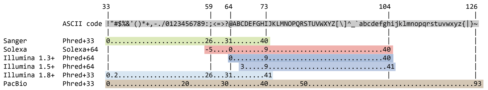

::::{.notes}
::: {style="font-size: 9pt"}
**Obiettivo:** Spiegare come il Phred quality score viene codificato in caratteri ASCII nel formato FASTQ.

- I numeri da 33 a 126 sono i valori ASCII corrispondenti ai caratteri usati per codificare gli score
- Il valore ASCII del carattere meno 33 dà il Phred score (es. "!" = ASCII 33 → Q0)
- Lo score massimo osservato in Illumina è tipicamente Q40, quindi la scala si ferma lì
- Score basso → alta probabilità di errore; score alto → base identificata con sicurezza
:::
::::

##  {background-image="images/back001.jpg" background-size="cover" background-opacity="0.1"}

[Raw reads: The Starting Point]{.subtit}

### FASTQ format

#### What does "quality score" mean?

::: f20
The quality score is used to identify the **probability of the correct identification of the corresponding nucleotide**.
:::

::: centerI
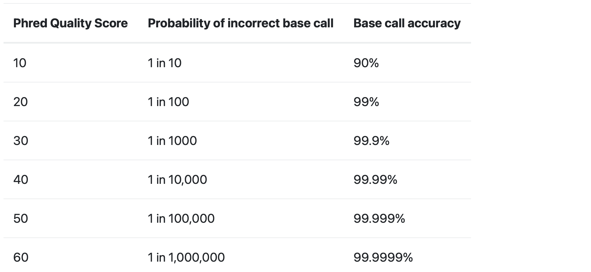{width=900}
:::

::::{.notes}
::: {style="font-size: 9pt"}
**Obiettivo:** Tradurre il Phred score in probabilità di errore e stabilire soglie pratiche per RNA-seq.

- **Q20** = 1% di probabilità di errore (1 base su 100 potenzialmente sbagliata): soglia minima accettabile per RNA-seq
- **Q30** = 0.1% di probabilità di errore (1 base su 1000): qualità ottima, quella che miriamo ad avere dopo il trimming
- La scala è **logaritmica**: Q30 non è "un po' meglio" di Q20, è 10 volte più accurato
- Nel report FastQC, un segnale verde per "Per Base Sequence Quality" significa che la mediana supera Q28 sull'intera lunghezza della read
:::
::::

##  {background-image="images/back001.jpg" background-size="cover" background-opacity="0.1"}

[Raw reads: The Starting Point]{.subtit}

### FASTQ format

- FASTQ files can be very large, so in most cases you won't be dealing with myFile.fastq, but with myFile.fastq.gz.

- This means that the file is compressed, so it is not readable by a text editor without first being decompressed.

::::{.notes}
::: {style="font-size: 9pt"}
**Obiettivo:** Prepararsi a lavorare con file compressi nella pipeline.

- I file `.fastq.gz` sono compressi con **gzip**: occupano 4-5 volte meno spazio rispetto al file non compresso
- La pipeline nf-core/rnaseq accetta direttamente i `.fastq.gz` senza decompressione manuale
- Per ispezionare il contenuto senza decomprimere: `zless file.fastq.gz` oppure `zcat file.fastq.gz | head`
- Non tentate di aprire questi file con un editor di testo normale: usate strumenti che gestiscono la compressione
:::
::::

##  {background-image="images/back001.jpg" background-size="cover" background-opacity="0.1"}

:::{.p-img-center}
{width=2000}
:::

::::{.notes}
::: {style="font-size: 9pt"}
Entriamo ora negli strumenti specifici del pre-processing: la pipeline ne usa diversi in sequenza, ognuno con uno scopo preciso.
:::
::::

##  {background-image="images/back001.jpg" background-size="cover" background-opacity="0.1"}

[Pre-processing Tools]{.subtit}

### FastQC

:::: {.columns}
::: {.column width="60%" .f30}
*   **What it is:** 
    * A widely used tool for quality assessment of raw sequencing data.
*   **What it does:**
    *   Generates comprehensive reports with various quality metrics.
    *   Visualizes data quality using interactive plots and graphs.
*   **Key metrics:**
    *   Per base sequence quality
    *   Per sequence quality scores
    *   Sequence length distribution
    *   GC content
    *   Adapter content
    *   Overrepresented sequences
:::
::: {.column width="30%"}
<br>
<br>
[[FastQC](https://www.bioinformatics.babraham.ac.uk/projects/fastqc/)]{.p-spam.center}
:::
:::: 

::::{.notes}
::: {style="font-size: 9pt"}
**Obiettivo:** Capire cosa fa FastQC e quali metriche sono più rilevanti per valutare la qualità di reads RNA-seq.

- **FastQC** produce report HTML leggibili anche senza competenze avanzate: è il primo strumento da usare dopo aver ricevuto i dati grezzi
- Le metriche più importanti per RNA-seq: **Per Base Sequence Quality** (Q score lungo la read), **Adapter Content** (adattatori da rimuovere), **GC Content** (anomalie indicano contaminazione)
- Un avviso rosso in FastQC non significa necessariamente dati inutilizzabili, ma richiede attenzione e interpretazione biologica
- In nf-core, FastQC viene eseguito **prima e dopo** il trimming: potrete confrontare il miglioramento qualitativo
- **MultiQC** aggrega i report di tutti i campioni in un unico documento interattivo: essenziale con decine di campioni
:::
::::

##  {background-image="images/back001.jpg" background-size="cover" background-opacity="0.1"}

:::{.p-img-center}
{width=2000}
:::

::::{.notes}
::: {style="font-size: 9pt"}
La pipeline procede ora con l'estrazione degli UMI — step opzionale ma fondamentale per librerie che li utilizzano.
:::
::::

##  {background-image="images/back001.jpg" background-size="cover" background-opacity="0.1"}

[Pre-processing Tools]{.subtit}

### UMI-tools extract

:::: {.columns}
::: {.column width="50%" .f25}
*   **What are UMIs?**
    *   Unique Molecular Identifiers (UMIs) are short random sequences attached to each cDNA molecule during library preparation.
    *   They act as "molecular barcodes" to identify unique molecules.
*   **Why are UMIs important?**
    *   UMIs help to distinguish PCR duplicates from true biological duplicates.
    *   This improves the accuracy of gene expression quantification, especially for low-abundance transcripts.
:::
::: {.column width="50%" .f25}
*   **What does `UMI-tools extract` do?**
    *   Identifies and extracts UMIs from sequencing reads.
    *   Moves UMIs to the read name for downstream analysis.
    *   Requires information about the UMI location in the read.
*   **Benefits:**
    *   Improved accuracy in gene expression quantification.
    *   Reduced bias due to PCR amplification.<br>
<br>
[[UMI-tools](https://umi-tools.readthedocs.io/en/latest/index.html)]{.p-spam.center}
:::
:::: 

:::{.p-img-center}
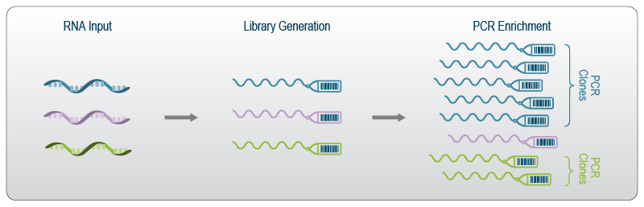{width=1000}
:::

::::{.notes}
::: {style="font-size: 9pt"}
**Obiettivo:** Spiegare perché gli UMI risolvono il problema dei duplicati PCR in modo più accurato rispetto ai metodi basati sulla posizione genomica.

- Gli **UMI (Unique Molecular Identifiers)** sono brevi sequenze casuali (6-12 nt) aggiunte al cDNA durante la preparazione della libreria, prima dell'amplificazione PCR
- Ogni molecola di cDNA riceve un UMI unico: dopo la PCR, tutte le copie dello stesso trascritto originale avranno il **medesimo UMI**
- Senza UMI non possiamo distinguere due reads identiche provenienti dallo stesso trascritto biologico da copie PCR della stessa molecola
- `UMI-tools extract` sposta la sequenza UMI dall'inizio della read al nome della read, per usarla nella deduplicazione downstream
- Questo step è rilevante solo se il vostro protocollo prevede UMI (es. 10x Chromium, CEL-Seq2, certi kit Illumina per RNA totale)
:::
::::

##  {background-image="images/back001.jpg" background-size="cover" background-opacity="0.1"}

:::{.p-img-center}
{width=2000}
:::

::::{.notes}
::: {style="font-size: 9pt"}
Il trimming è il passo fondamentale per pulire le reads prima dell'allineamento: vediamo i due strumenti più usati nella pipeline.
:::
::::


##  {background-image="images/back001.jpg" background-size="cover" background-opacity="0.1"}

[Pre-processing Tools]{.subtit}

### [FastP](https://github.com/OpenGene/fastp) & [Trim Galore!](https://github.com/FelixKrueger/TrimGalore)

:::: {.columns}
::: {.column width="50%" .f30}
*   **Purpose:**  
    * To clean up raw sequencing data and improve the accuracy of downstream analysis.
*   **Key functions:**
    *   **Adapter trimming:**  Remove adapter sequences from reads.
    *   **Quality trimming:**  Trim low-quality bases from the ends of reads.
*   **FastP:**
    *   All-in-one tool with extensive pre-processing features.
    *   Includes quality filtering, error correction, UMI handling, and more.

:::
::: {.column width="50%" .f30}
*   **Trim Galore!:**
    *   Wrapper script for `cutadapt` (adapter trimming) and often includes `FastQC` (quality assessment).
    *   Focuses on adapter and quality trimming with optimized parameters.
*   **Benefits:**
    *   Improved alignment accuracy.
    *   Reduced false positives in variant calling and gene expression analysis.
    *   Increased efficiency of downstream analysis.
:::
:::: 

::::{.notes}
::: {style="font-size: 9pt"}
**Obiettivo:** Capire perché il trimming migliora la qualità dell'analisi downstream e quando scegliere FastP vs Trim Galore!.

- Il **trimming degli adattatori** rimuove le sequenze Illumina che contaminano le reads quando l'inserto cDNA è più corto del ciclo di lettura — senza rimozione causano errate mappature
- Il **quality trimming** taglia le basi di bassa qualità alle estremità (Q < 20): migliora il tasso di allineamento e la precisione della quantificazione
- **FastP** è più moderno: gestisce in un unico passaggio adattatori, quality, lunghezza minima e UMI — più veloce e con report HTML integrato
- **Trim Galore!** è uno wrapper consolidato di `cutadapt` con parametri ottimizzati per Illumina: scelta più conservativa e ampiamente validata
- In nf-core potete scegliere tra i due con il parametro `--trimmer`; il default è **Trim Galore!**
:::
::::

##  {background-image="images/back001.jpg" background-size="cover" background-opacity="0.1"}

:::{.p-img-center}
{width=2000}
:::

::::{.notes}
::: {style="font-size: 9pt"}
Alcuni esperimenti richiedono uno step aggiuntivo: la rimozione di reads provenienti da organismi contaminanti o da sequenze non desiderate.
:::
::::

##  {background-image="images/back001.jpg" background-size="cover" background-opacity="0.1"}

[Pre-processing Tools]{.subtit}

### BBSplit

:::: {.columns}
::: {.column width="60%" .f30}
*   **What it is:**  
    * A tool for removing contaminant reads from sequencing data.
*   **Types of contamination:**
    *   Microbial DNA or RNA
    *   Host DNA (in the case of RNA-Seq from host-associated samples)
    *   Other unwanted sequences
*   **How it works:**
    *   Aligns reads to a database of contaminant sequences.
    *   Removes reads that map to the contaminant database.

:::
::: {.column width="30%"}
<br>
<br>
[[BBMap](https://sourceforge.net/projects/bbmap/)]{.p-spam.center}
:::
:::: 

::::{.notes}
::: {style="font-size: 9pt"}
**Obiettivo:** Capire quando BBSplit è necessario e come funziona la separazione di reads da più genomi.

- **BBSplit** allinea le reads a un database di genomi in parallelo e assegna ogni read all'organismo di provenienza più probabile
- È essenziale negli esperimenti **host-pathogen** (es. cellule umane infettate da virus) dove si vogliono separare le reads umane da quelle virali o batteriche
- Può anche rimuovere contaminazione da micoplasma o altri microorganismi presenti nelle colture cellulari
- In un tipico esperimento RNA-seq su linee cellulari umane questo step è opzionale, ma vale la pena attivarlo se avete dubbi sulla purezza del campione
:::
::::

##  {background-image="images/back001.jpg" background-size="cover" background-opacity="0.1"}

[Pre-processing Tools]{.subtit}

### SortMeRNA

:::: {.columns}
::: {.column width="60%" .f30}
*   **What it is:**  
    * A tool for filtering ribosomal RNA (rRNA) reads from sequencing data.
*   **Why is it important?**
    *   rRNA often makes up a large proportion of total RNA.
    *   Removing rRNA enriches for mRNA and other non-coding RNAs of interest.
*   **How it works:**
    *   Uses a database of rRNA sequences to identify and remove rRNA reads.
    *   Can be used with both single-end and paired-end data.

:::
::: {.column width="30%"}
<br>
<br>
[[SortMeRNA](https://sortmerna.readthedocs.io/en/latest/)]{.p-spam.center}
:::
:::: 

::::{.notes}
::: {style="font-size: 9pt"}
**Obiettivo:** Spiegare la contaminazione da rRNA nell'RNA-seq e come SortMeRNA la gestisce in silico.

- L'**rRNA ribosomiale** costituisce il 70-90% dell'RNA totale cellulare: se non si esegue una deplezione durante la preparazione la libreria, domina il sequenziamento
- La deplezione di rRNA si fa in laboratorio (kit RiboZero per RNA totale, poly-A selection per mRNA), ma non è mai completa al 100%
- **SortMeRNA** identifica le reads residue che provengono da rRNA usando un database di sequenze ribosomiali e le rimuove *in silico*
- Se il report indica una percentuale di rRNA superiore al 30-40%, è un campanello d'allarme sulla qualità della preparazione della libreria
:::
::::

#  {background-image="images/back001.jpg" background-size="cover" background-opacity="0.1"}

[Alignment and Quantification]{.tit .p-span-center}

::::{.notes}
::: {style="font-size: 9pt"}
**Obiettivo:** Introdurre la sezione della pipeline dedicata all'allineamento e quantificazione delle reads.

- Siamo arrivati al cuore della pipeline: le reads vengono "posizionate" sul genoma di riferimento e si stima l'abbondanza di ogni gene o trascritto
- In questa sezione vedremo gli **allineatori** (STAR e HISAT2), il **formato BAM** per lo storage degli allineamenti, e i tool di **quantificazione** (RSEM e Salmon)
- Comprendere bene questa fase è fondamentale: la qualità degli allineamenti determina direttamente i risultati dell'analisi differenziale
:::
::::

##  {background-image="images/back001.jpg" background-size="cover" background-opacity="0.1"}

:::{.p-img-center}
{width=2000}
:::

::::{.notes}
::: {style="font-size: 9pt"}
**Obiettivo:** Orientare gli studenti nella pipeline nf-core prima di entrare nel dettaglio dell'allineamento.

- Qui vediamo il diagramma completo: ogni blocco colorato corrisponde a un tool specifico della pipeline
- Ci troviamo nella fase centrale: dal **FASTQ trimmat** passiamo ora all'**allineamento** sul genoma di riferimento
:::
::::

##  {background-image="images/back001.jpg" background-size="cover" background-opacity="0.1"}

[Alignment and Quantification]{.subtit}

### Read Alignment


:::: {.columns}
::: {.column width="50%" .f30}
*   **Purpose:** 
    * To map sequencing reads to a reference genome or transcriptome.
*   **Why is it important?**
    *   Identify the genomic origin of each read.
    *   Determine which genes or transcripts are expressed.
    *   Discover genetic variations (SNPs, indels).
:::
::: {.column width="50%" .f30}
*   **Challenges:**
    *   Reads may contain sequencing errors.
    *   Reads may map to multiple locations (multi-mapping reads).
    *   Genomes contain repetitive regions.
*   **Output:**  A BAM (Binary Alignment/Map) file containing alignment information.

:::
:::: 

:::{.p-img-center}
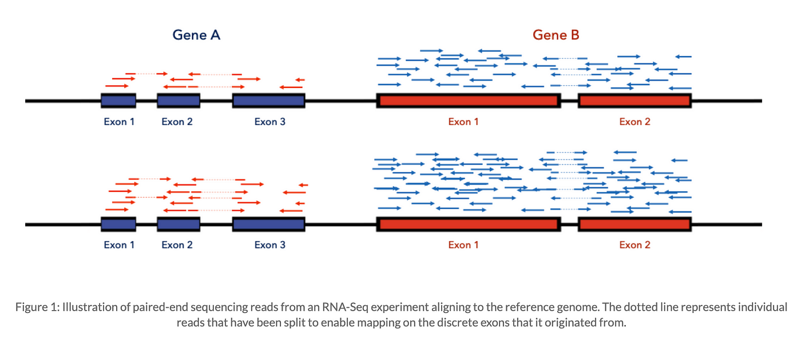{width=1000}
:::

::::{.notes}
::: {style="font-size: 9pt"}
**Obiettivo:** Spiegare il concetto fondamentale di allineamento delle reads al genoma di riferimento.

- **Allineamento (mapping):** processo con cui ogni read viene "posizionata" sul genoma → identifichiamo da quale gene o trascritto proviene ciascuna read
- È importante perché da questo passaggio dipende l'intera stima dell'espressione genica: una read non mappata è informazione persa
- **Sfide principali:** errori di sequenziamento, reads che si mappano in più loci (**multi-mapping**), regioni ripetitive del genoma
- **Output BAM:** file binario compresso che registra la posizione, la qualità della mappatura e l'orientamento di ogni read sul genoma
:::
::::

##  {background-image="images/back001.jpg" background-size="cover" background-opacity="0.1"}

[Alignment and Quantification]{.subtit}

### SAM/BAM Format:  Storing Alignment Information

*   **What it is:**  
    *   The standard file format for storing read alignments.
    *   **SAM (Sequence Alignment/Map):**  A text-based format.
    *   **BAM (Binary Alignment/Map):**  A compressed binary version of SAM.
*   **Why is it important?**
    *   Provides a standardized way to store alignment information.
    *   Allows for efficient storage and retrieval of large alignment datasets.
    *   Facilitates compatibility between different bioinformatics tools.

::::{.notes}
::: {style="font-size: 9pt"}
**Obiettivo:** Presentare SAM e BAM come il formato standard per lo storage degli allineamenti NGS.

- **SAM (Sequence Alignment/Map):** formato testuale, leggibile con un editor — utile per ispezione manuale ma molto voluminoso
- **BAM (Binary Alignment/Map):** versione binaria compressa di SAM — occupa 3-4× meno spazio ed è molto più veloce da processare
- Nella pratica si lavora quasi sempre con **file BAM**; il formato SAM serve principalmente per debug o verifica manuale
- È il formato standard della bioinformatica NGS: garantisce compatibilità tra STAR, HISAT2, SAMtools, Picard e tutti i tool downstream
:::
::::

##  {background-image="images/back001.jpg" background-size="cover" background-opacity="0.1"}

[Alignment and Quantification]{.subtit}

### SAM/BAM Format:  Storing Alignment Information

*   **Content:**
    *   **Header section**: Contains metadata about the alignment (reference genome, aligner used, etc.).

::: code
    @RG     ID:1    SM:C5926_BM_IonCode_0118
    @PG     ID:samtools     PN:samtools    VN:1.16.1    CL:samtools view -H C5926_BM_IonCode_0118.reassembled.bam
:::


::::{.notes}
::: {style="font-size: 9pt"}
**Obiettivo:** Spiegare i campi dell'header SAM/BAM e il significato dei tag RG (read group) e PG (programma).

- @RG = Read Group: raggruppa le reads provenienti dallo stesso campione/run di sequenziamento
  - ID = identificatore del read group; SM = nome del campione (Sample)
- @PG = Program: registra quale software ha prodotto o modificato il file
  - ID = identificatore del programma; PN = nome del programma; VN = versione software; CL = riga di comando eseguita
:::
::::

##  {background-image="images/back001.jpg" background-size="cover" background-opacity="0.1"}

[Alignment and Quantification]{.subtit}

### SAM/BAM Format:  Storing Alignment Information

*   **Alignment section**:  Each line represents a single read and its alignment to the reference.
    *   Includes information about mapping position, quality scores, alignment flags, and more.

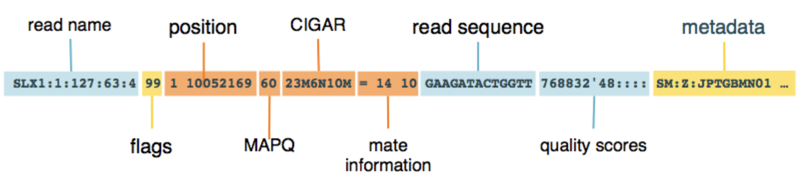{.absolute top="500" left="0" width="800" height="auto"}

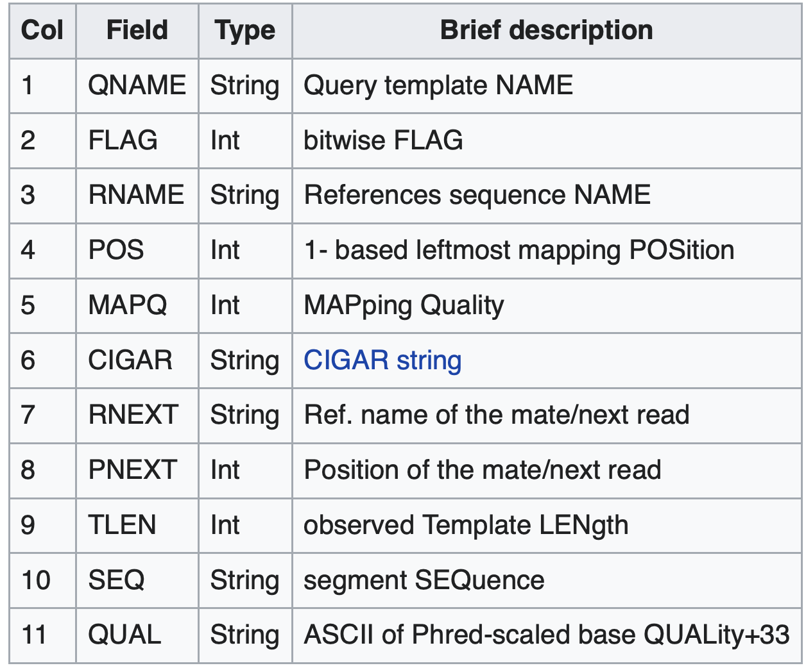{.absolute top="400" right="20" width="550" height="auto"}

::::{.notes}
::: {style="font-size: 9pt"}
**Obiettivo:** Spiegare la struttura della sezione di allineamento del file BAM e il significato delle informazioni memorizzate per ogni read.

- Ogni riga della sezione allineamenti ha 11 campi obbligatori (QNAME, FLAG, RNAME, POS, MAPQ, CIGAR, ecc.)
- I campi opzionali (metadati) sono coppie tag:tipo:valore che variano in base al software usato
- La stringa CIGAR (Concise Idiosyncratic Gapped Alignment Report) descrive l'allineamento: M=match, I=inserzione, D=delezione, N=salto intronico
- Il FLAG codifica in binario le proprietà della read (paired-end, unmapped, reverse strand, duplicato, ecc.)
:::
::::

##  {background-image="images/back001.jpg" background-size="cover" background-opacity="0.1"}

:::{.p-img-center}
{width=2000}
:::

::::{.notes}
::: {style="font-size: 9pt"}
**Obiettivo:** Transizione verso la presentazione di STAR come allineatore di riferimento per RNA-seq.

- Qui vediamo la posizione di **STAR** nel diagramma della pipeline nf-core: è l'allineatore di default per la maggior parte dei workflow RNA-seq
:::
::::

##  {background-image="images/back001.jpg" background-size="cover" background-opacity="0.1"}

[Alignment and Quantification]{.subtit}

### [STAR Aligner](https://github.com/alexdobin/STAR)


:::: {.columns}
::: {.column width="30%" .f40}
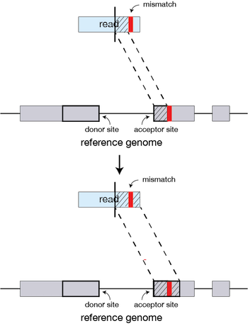{width=400}
:::
::: {.column width="70%" .f30}
*   **What it is:**  
    * A widely used splice-aware aligner for RNA-Seq data.
*   **Key features:**
    *   Fast and efficient alignment.
    *   Accurate handling of spliced reads.
    *   Can detect novel splice junctions.
    *   Supports various RNA-Seq protocols.
*   **Advantages:**
    *   High accuracy
    *   Speed
    *   Versatility
:::
:::: 

::::{.notes}
::: {style="font-size: 9pt"}
**Obiettivo:** Presentare STAR come allineatore splice-aware e spiegare perché è lo standard de facto per RNA-seq.

- **STAR (Spliced Transcripts Alignment to a Reference):** progettato specificamente per RNA-seq, con gestione nativa delle giunzioni di splicing
- È essenziale essere **splice-aware**: una read può attraversare la giunzione tra due esoni separati da un introne di migliaia di basi nel genoma — un allineatore genomico ordinario non la gestirebbe correttamente
- **Novel splice junctions:** STAR rileva giunzioni di splicing non ancora annotate nel file GTF/GFF — prezioso per studi di trascrittoma
- Produce file BAM ordinati con coordinate genomiche; richiede circa 30 GB di RAM per il genoma umano (costruisce un grande indice in memoria)
- In nf-core/rnaseq è l'allineatore di **default**; HISAT2 si attiva con il parametro `--aligner hisat2`
:::
::::

##  {background-image="images/back001.jpg" background-size="cover" background-opacity="0.1"}

[Alignment and Quantification]{.subtit}

### [HISAT2](http://daehwankimlab.github.io/hisat2/)


:::: {.columns}
::: {.column width="30%" .f40}
{width=400}
:::
::: {.column width="70%" .f30}
*   **What it is:** 
    *   Another popular splice-aware aligner for RNA-Seq.
*   **Key features:**
    *   Based on the Burrows-Wheeler transform.
    *   Fast and memory-efficient.
    *   Supports both DNA and RNA alignment.
*   **Comparison to STAR:**
    *   May be slightly faster for some datasets.
    *   May have slightly lower accuracy for certain types of reads.
    *   Choice often depends on specific needs and preferences.
:::
:::: 

::::{.notes}
::: {style="font-size: 9pt"}
**Obiettivo:** Presentare HISAT2 come alternativa a STAR e fornire criteri pratici per la scelta tra i due allineatori.

- **HISAT2** usa la **trasformata di Burrows-Wheeler (BWT)**, che produce un indice molto più compatto rispetto a STAR
- Richiede molto meno **RAM** (~8 GB per il genoma umano vs ~30 GB di STAR) — ideale in ambienti con risorse computazionali limitate
- È anch'esso **splice-aware** e supporta sia sequenze DNA che RNA — versatile per tipi diversi di analisi
- STAR rimane preferito per l'accuratezza nel rilevare giunzioni novel; **HISAT2** è la scelta quando la memoria è un vincolo
:::
::::

##  {background-image="images/back001.jpg" background-size="cover" background-opacity="0.1"}

:::{.p-img-center}
{width=2000}
:::

::::{.notes}
::: {style="font-size: 9pt"}
**Obiettivo:** Transizione verso la deduplicazione con UMI post-allineamento.

- Qui vediamo dove si posiziona **UMI-tools dedup** nel flussogramma: è uno step opzionale che si attiva solo se la libreria è stata preparata con **UMI** (Unique Molecular Identifiers)
:::
::::

##  {background-image="images/back001.jpg" background-size="cover" background-opacity="0.1"}

[Alignment and Quantification]{.subtit}

### UMI-tools dedup


:::: {.columns}
::: {.column width="30%" .f40}
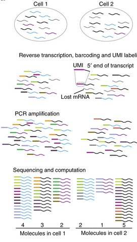{width=400}
:::
::: {.column width="70%" .f25}
*   **What it does:**
    *   Identifies and removes PCR duplicates from RNA-Seq data using Unique Molecular Identifiers (UMIs).
    *   Groups reads with the same UMI and genomic mapping location.
    *   Selects the read with the highest quality score as the representative read for each group.
*   **Why is it important?**
    *   PCR amplification during library preparation can introduce duplicate reads.
    *   These duplicates can bias gene expression estimates, especially for low-abundance transcripts.
    *   `UMI-tools dedup` helps to correct for this bias and improve accuracy.
*   **Benefits:**
    *   More accurate gene expression quantification.
    *   Reduced false positives in differential expression analysis.
    *   Improved sensitivity for detecting rare transcripts.


[[UMI-tools](https://umi-tools.readthedocs.io/en/latest/index.html)]{.p-spam.center}
:::
:::: 

::::{.notes}
::: {style="font-size: 9pt"}
**Obiettivo:** Spiegare la deduplicazione basata su UMI e perché migliora l'accuratezza della quantificazione.

- **Duplicati PCR:** durante la preparazione della libreria, l'amplificazione PCR crea copie identiche della stessa molecola — questi duplicati distorcono la stima dell'espressione genica
- **UMI (Unique Molecular Identifiers):** sequenze random brevi (~6-12 bp) aggiunte a ogni molecola durante la ligazione → ogni frammento originale riceve un identificatore unico
- **UMI-tools dedup** raggruppa le reads con **stesso UMI + stessa posizione genomica** → mantiene solo la read con qualità migliore per ogni gruppo di origine
- Senza deduplicazione, i geni più amplificati dalla PCR risulterebbero erroneamente sovra-espressi, con impatto diretto sull'analisi differenziale
:::
::::

##  {background-image="images/back001.jpg" background-size="cover" background-opacity="0.1"}

:::{.p-img-center}
{width=2000}
:::

::::{.notes}
::: {style="font-size: 9pt"}
**Obiettivo:** Transizione verso RSEM come tool di quantificazione basato su allineamento.

- Qui vediamo **RSEM** nel diagramma: è il tool di quantificazione che lavora a partire dai **file BAM** prodotti dall'allineamento per stimare l'abbondanza di geni e isoforme
:::
::::


##  {background-image="images/back001.jpg" background-size="cover" background-opacity="0.1"}

[Alignment and Quantification]{.subtit}

### [RSEM](https://github.com/deweylab/RSEM)


:::: {.columns}
::: {.column width="50%" .f40}
<br>
<br>

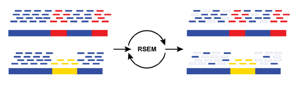{width=700}
:::
::: {.column width="50%" .f30}
*   **What it is:**  
    *   RSEM is a software package for estimating gene and isoform expression levels from RNA-Seq data.
*   **Key features:**
    *   Uses a statistical model to estimate transcript abundance from aligned reads.
    *   Can handle different types of RNA-Seq data (single-end, paired-end).
    *   Provides various output formats (counts, TPM, FPKM).
:::
:::: 

::::{.notes}
::: {style="font-size: 9pt"}
**Obiettivo:** Spiegare le diverse metriche di normalizzazione dell'abbondanza dei trascritti prodotte da RSEM e quando usarle.

- RPKM/FPKM (Reads/Fragments Per Kilobase per Million): normalizza per lunghezza del gene e profondità totale, ma non confrontabile tra campioni diversi
- TPM (Trascritti Per Kilobase per Milione): normalizza prima per lunghezza, poi per profondità → confrontabile tra campioni, attualmente lo standard preferito
- I counts grezzi (non normalizzati) sono richiesti da DESeq2 ed edgeR per l'analisi differenziale
- RSEM fornisce tutti e tre i formati nell'output, ma per DE usare sempre i counts grezzi
:::
::::


#  {background-image="images/back001.jpg" background-size="cover" background-opacity="0.1"}

[Pseudo-aligners]{.tit .p-span-center}

[A New Approach to Quantification]{.f50 .p-span-center}

::::{.notes}
::: {style="font-size: 9pt"}
**Obiettivo:** Introdurre la sezione sui pseudo-allineatori come approccio alternativo e più moderno alla quantificazione dell'espressione genica.

- In questa sezione esploriamo i **pseudo-allineatori**, strumenti nati per superare i limiti computazionali dell'allineamento classico al genoma di riferimento
- **Salmon** e **Kallisto** sono i rappresentanti principali: invece di determinare la posizione genomica precisa di ogni read, usano algoritmi leggeri per assegnare le reads direttamente ai trascritti
- Questi strumenti sono oggi lo standard per molti workflow RNA-seq grazie alla loro velocità e all'accuratezza comparabile ai metodi tradizionali
:::
::::

##  {background-image="images/back001.jpg" background-size="cover" background-opacity="0.1"}

:::{.p-img-center}
{width=2000}
:::

::::{.notes}
::: {style="font-size: 9pt"}
**Obiettivo:** Mostrare il posizionamento del modulo pseudo-allineamento nella pipeline nf-core.

- Qui vediamo il diagramma completo della pipeline: il blocco **Salmon/Kallisto** si attiva quando si sceglie la quantificazione pseudo-allineata al posto di STAR+featureCounts
:::
::::


##  {background-image="images/back001.jpg" background-size="cover" background-opacity="0.1"}

[Pseudo-aligners]{.subtit}

### Fast and Efficient Transcript Abundance Estimation

:::: {.columns}
::: {.column width="60%" .f30}
*   **What they are:**  
    * A class of RNA-Seq quantification tools that do not require exact alignment of reads to a reference genome.
*   **How they work:**
    *   Use lightweight algorithms to assign reads to transcripts    
    *   Effectively "pseudo-align" reads to transcripts without determining their precise genomic location.
*   **Advantages:**
    *   **Speed:**  Significantly faster than traditional alignment-based methods.
    *   **Efficiency:**  Reduced computational resources required.
    *   **Accuracy:**  Comparable or even superior accuracy for transcript quantification.
:::
::: {.column width="40%" .f30}
*   **Popular tools:**
    *   Salmon
    *   Kallisto
*   **Applications:**
    *   Gene expression profiling
    *   Differential expression analysis
    *   Transcript isoform identification
:::
:::: 

::::{.notes}
::: {style="font-size: 9pt"}
**Obiettivo:** Spiegare il concetto di pseudo-allineamento e i suoi vantaggi rispetto all'allineamento classico.

- **Pseudo-allineamento:** invece di trovare la posizione esatta della read sul genoma, si determina solo a quale trascritto appartiene — un concetto detto *compatibilità* — eliminando l'allineamento tradizionale a coppie
- La differenza fondamentale con STAR/HISAT2 è la velocità: Salmon è **10-100× più rapido** perché lavora sull'indice del trascrittoma, non sull'intero genoma
- **Accuratezza comparabile:** il modello di bias di Salmon (GC content, posizione, sequenza) porta a stime dell'espressione altrettanto affidabili rispetto agli allineatori classici
- È importante sapere che i pseudo-allineatori quantificano i **trascritti**: i counts vengono poi aggregati a livello di gene con **tximport** in R
:::
::::


##  {background-image="images/back001.jpg" background-size="cover" background-opacity="0.1"}

[Pseudo-aligners]{.subtit}

### Kallisto vs Salmon

::: f30
| Feature            | [Kallisto]{.f50} {width=100} | [Salmon]{.f50} {width=190}                |
|---------------------|------------------------|-------------------------|
| **Algorithm**       | Pseudoalignment (k-mers) | Quasi-mapping (BWT)     |
| **Speed**           | Fast                   | Faster                  |
| **Memory Usage**    | Lower                  | Higher                  |
| **Features**         | Basic                  | More advanced (library types, bootstrapping) |
| **Accuracy**        | High                   | High                    |
| **Ease of Use**     | High                   | High                    |
| **Output Formats**  | Abundance estimates     | Abundance estimates, counts, TPM, etc. |
| **Applications**   | Gene expression, DE analysis | Gene expression, DE analysis, isoform quantification |

:::

::::{.notes}
::: {style="font-size: 9pt"}
**Obiettivo:** Confrontare Kallisto e Salmon e motivare la scelta di Salmon come default in nf-core.

- **nf-core/rnaseq usa Salmon di default** perché offre modellazione più sofisticata dei bias (sequenza, GC content, posizione) e gestisce meglio campioni con diverse tipologie di libreria
- **Kallisto** rimane un'ottima scelta per analisi rapide o pipeline custom: la sua semplicità lo rende ideale per studi di screening o grandi coorti dove la velocità è critica
- Entrambi richiedono un **indice del trascrittoma** costruito in anticipo — nf-core lo costruisce automaticamente da FASTA + GTF
- Per i corsi di analisi differenziale, è sufficiente capire che Salmon genera i file di quantificazione che importeremo in R con **tximport**
:::
::::


##  {background-image="images/back001.jpg" background-size="cover" background-opacity="0.1"}

[Pseudo-aligners]{.subtit}

### Salmon Output File Formats

::: {layout="[40,-20,60]"}

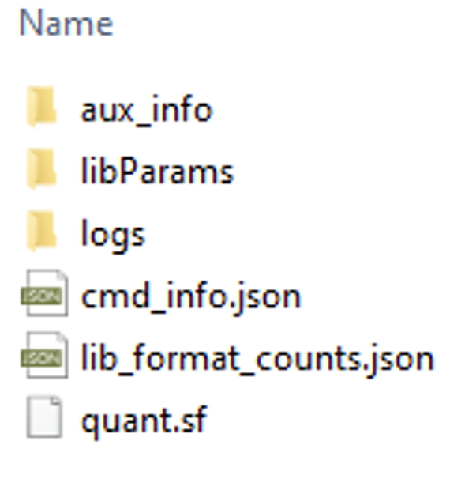

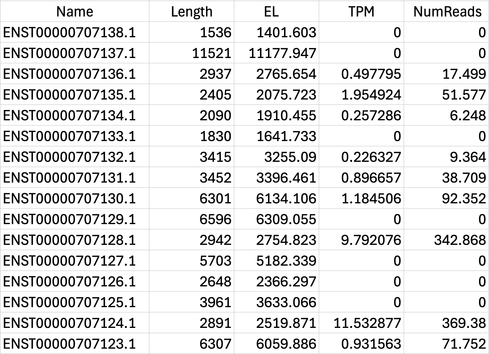
:::

::::{.notes}
::: {style="font-size: 9pt"}
**Obiettivo:** Descrivere i file di output di Salmon e identificare quello che useremo in R.

- **quant.sf** è il file principale di Salmon: contiene per ogni trascritto le colonne Name, Length, EffectiveLength, TPM e NumReads — è questo file che importiamo in R con **tximport**
- **cmd_info.json** registra i parametri esatti del comando: fondamentale per la riproducibilità e per documentare l'analisi
- La cartella **aux_info/** contiene `meta_info.json` con statistiche del run (frammenti osservati, mappati, tasso di mappatura) e — se Salmon ha inferito automaticamente il tipo di libreria — l'esito dell'inferenza
- **lib_format_counts.json** riporta quanti frammenti sono compatibili con ciascun tipo di libreria: utile per verificare che il parametro `--libType` sia corretto
- Nella pratica del corso: lavoreremo direttamente con **quant.sf** tramite tximport, che aggrega i conteggi a livello di gene e li prepara per DESeq2
:::
::::

#  {background-image="images/back001.jpg" background-size="cover" background-opacity="0.1"}

[Post-alignment Processing]{.tit .p-span-center}

::::{.notes}
::: {style="font-size: 9pt"}
**Obiettivo:** Introdurre la sezione che descrive le operazioni eseguite dopo l'allineamento al genoma.

- Dopo che le reads sono state allineate al genoma, la pipeline applica una serie di step di **raffinamento** prima di procedere all'analisi downstream
- Questa sezione è rilevante soprattutto per il workflow basato su **STAR**: per Salmon, che lavora sul trascrittoma, molti di questi step non si applicano
:::
::::

##  {background-image="images/back001.jpg" background-size="cover" background-opacity="0.1"}

:::{.p-img-center}
{width=2000}
:::

::::{.notes}
::: {style="font-size: 9pt"}
**Obiettivo:** Mostrare il posizionamento del post-processing nella pipeline nf-core.

- Qui vediamo come i blocchi di **deduplicazione** e **coverage** si inseriscono nella pipeline dopo l'allineamento con STAR e prima del controllo qualità finale con MultiQC
:::
::::

##  {background-image="images/back001.jpg" background-size="cover" background-opacity="0.1"}

[Post-alignment Processing]{.subtit}

### Refining Your Alignments

::: f30
*   **What it is:** 
    * A series of steps performed after read alignment to improve data quality and prepare for downstream analysis.
*   **Key steps:**
    *   **Deduplication:**  Removing PCR duplicates to avoid bias in gene expression estimates. (Blue line)
    *   **Generating coverage tracks:**  Visualizing read distribution and assessing sequencing uniformity.
    *   **(Optional) Other steps:**  Depending on the analysis goals, this may include filtering reads, recalibrating base quality scores, and other processing steps.
*   **Why is it important?**
    *   Improves the accuracy and reliability of downstream analysis.
    *   Reduces noise and bias in the data.
    *   Facilitates data interpretation and visualization.
:::

::::{.notes}
::: {style="font-size: 9pt"}
**Obiettivo:** Motivare l'importanza del post-processing per la qualità dell'analisi differenziale.

- **Deduplicazione:** i duplicati di PCR sono copie artificiali dello stesso frammento originale — se non rimossi, sovrastimano l'espressione di certi trascritti in proporzione all'efficienza di amplificazione, non all'abbondanza biologica
- **Coverage tracks:** generare tracce in formato bigWig o BEDGraph permette di visualizzare la distribuzione delle reads nei geni con IGV — un controllo visivo fondamentale per verificare l'uniformità della copertura
- È importante ricordare che questi step **migliorano la qualità** ma non sostituiscono un buon design sperimentale: un campione mal preparato non si recupera con il post-processing
:::
::::

##  {background-image="images/back001.jpg" background-size="cover" background-opacity="0.1"}

[Post-alignment Processing]{.subtit}

### [SAMtools](https://samtools.github.io/): Manipulating and Analyzing Alignments

::: f30
*   **What it is:**  
    * A suite of command-line utilities for working with SAM/BAM files.
    * A Swiss Army Knife for SAM/BAM Files
*   **Key functions:**
    *   **`samtools sort`:** Sorts alignments in a BAM file by coordinate.
        *   Why is sorting important?  Many downstream tools require sorted BAM files for efficient processing.
    *   **`samtools index`:** Creates an index file for a sorted BAM file.
        *   Why is indexing important?  Allows for fast retrieval of specific regions of the alignment.
    *   **`samtools stats`:**  Generates statistics about an alignment file.
        *   Provides insights into alignment quality, read depth, and other metrics.
:::

::::{.notes}
::: {style="font-size: 9pt"}
**Obiettivo:** Presentare SAMtools come strumento fondamentale per la manipolazione dei file BAM nella pipeline.

- **SAMtools** è il "coltellino svizzero" dei file BAM/SAM: quasi ogni pipeline bioinformatica NGS lo usa in almeno uno step
- **`samtools sort`:** ordina le reads per coordinata genomica — passaggio obbligatorio prima dell'indicizzazione, richiesto da GATK, Picard e tutti i browser genomici
- **`samtools index`:** crea il file `.bai` che consente l'accesso rapido a regioni specifiche del BAM senza leggerlo interamente — essenziale per IGV e tool che lavorano per regioni
- **`samtools stats`:** genera un report con tasso di allineamento, copertura media e distribuzione della qualità delle basi — un ulteriore layer di QC dopo il mapping
:::
::::

##  {background-image="images/back001.jpg" background-size="cover" background-opacity="0.1"}

[Post-alignment Processing]{.subtit}

### [Picard](https://broadinstitute.github.io/picard/) MarkDuplicates:  Deduplication without UMIs

::: f40
*   **How it works:**
    *   Identifies duplicates based on mapping coordinates of reads.
    *   Marks duplicate reads in the BAM file.
*   **Considerations:**
    *   Less accurate than UMI-based methods.
    *   Can be used when UMIs are not available.
    *   Often used in combination with other filtering steps.
:::

::::{.notes}
::: {style="font-size: 9pt"}
**Obiettivo:** Spiegare la deduplicazione basata su coordinate come alternativa ai metodi UMI.

- **Picard MarkDuplicates** identifica i duplicati confrontando le coordinate di inizio allineamento delle coppie di reads: se due read-pairs iniziano esattamente alla stessa posizione, vengono considerate duplicati
- Il tool **marca** i duplicati nel campo FLAG del BAM senza rimuoverli, lasciando la scelta all'utente — approccio conservativo che permette ispezioni successive
- **Limitazione importante:** senza **UMI** (Unique Molecular Identifiers), reads indipendenti che iniziano alla stessa coordinata vengono erroneamente marcate come duplicati — rischio di *over-deduplication* in regioni ad alta copertura
- nf-core applica Picard come step standard; se il protocollo include UMI, si usa invece il modulo **UMI-tools**
:::
::::


##  {background-image="images/back001.jpg" background-size="cover" background-opacity="0.1"}

[Post-alignment Processing]{.subtit}


### [BEDTools](https://bedtools.readthedocs.io/en/latest/) genomecov:  Quantifying Read Depth

::: f40
*   **What it does:**
    *   Calculates the number of reads overlapping each position in the genome.
    *   Outputs a coverage file in various formats (BEDGRAPH, bed, etc.).
*   **Options:**
    *   Calculate coverage for different strand orientations.
    *   Normalize coverage by library size.
    *   Generate histograms of coverage depth.
:::

::::{.notes}
::: {style="font-size: 9pt"}
**Obiettivo:** Spiegare l'utilità del calcolo della copertura per la visualizzazione e il controllo qualità.

- **BEDTools genomecov** calcola per ogni posizione del genoma quante reads la coprono, generando file in formato **BEDGRAPH** o **bigWig** — i formati standard per browser genomici come IGV o UCSC
- Le coverage tracks sono il primo strumento visivo per verificare che le reads si distribuiscano uniformemente sui corpi genici — un segnale di problemi di degradazione o bias di 3' nella libreria emerge chiaramente da questi grafici
- La normalizzazione per dimensione di libreria permette di **confrontare campioni** con profondità di sequenziamento diverse nello stesso browser genomico
- Nella pratica: caricare le tracce bigWig in IGV è uno step di QC visivo che nessun report automatico può sostituire completamente
:::
::::


#  {background-image="images/back001.jpg" background-size="cover" background-opacity="0.1"}

[Downstream Analysis]{.tit .p-span-center}

::::{.notes}
::: {style="font-size: 9pt"}
**Obiettivo:** Introdurre la sezione delle analisi post-allineamento: dagli strumenti di QC all'analisi differenziale.

- Siamo nella fase finale della pipeline: qui si valuta la qualità complessiva degli allineamenti, si identificano possibili bias, e si prepara la quantificazione per l'**analisi differenziale**
- Questa sezione include strumenti di QC avanzato (RSeQC, Preseq, Qualimap), strumenti di diagnosi (Kraken2) e il report riassuntivo finale (MultiQC)
:::
::::

##  {background-image="images/back001.jpg" background-size="cover" background-opacity="0.1"}

:::{.p-img-center}
{width=2000}
:::

::::{.notes}
::: {style="font-size: 9pt"}
Qui vediamo i blocchi di **downstream analysis** nel diagramma completo: RSeQC, Preseq, Qualimap, Kraken2 e MultiQC lavorano sugli output BAM o sulle reads per produrre metriche di qualità finali prima del report aggregato.
:::
::::

##  {background-image="images/back001.jpg" background-size="cover" background-opacity="0.1"}

[Downstream Analysis]{.subtit}

### [RSeQC](https://rseqc.sourceforge.net):  Comprehensive Quality Assessment of Your RNA-Seq Data

::: f25
*   **What it is:**  
    * A suite of tools for RNA-Seq quality control and analysis.
*   **Key functions:**
    *   **Read distribution:**  Assess the distribution of reads across different genomic features (e.g., coding regions, introns, UTRs).
    *   **Gene body coverage:**  Evaluate the uniformity of coverage across gene bodies.
    *   **Strand specificity:**  Check the strand specificity of the library.
    *   **Junction saturation:**  Determine if sufficient sequencing depth has been achieved for junction detection.
    *   **Other QC metrics:**  Assess rRNA contamination, insert size distribution, and more.
*   **Benefits:**
    *   Provides comprehensive quality assessment of RNA-Seq data.
    *   Identifies potential biases and issues in library preparation or sequencing.
    *   Helps to ensure the reliability and accuracy of downstream analysis.

:::

::::{.notes}
::: {style="font-size: 9pt"}
**Obiettivo:** Presentare RSeQC come strumento per identificare bias sistemici negli allineamenti RNA-seq.

- **RSeQC** calcola metriche di QC che FastQC non può fornire perché richiede l'allineamento al genoma: la distribuzione delle reads sui diversi elementi genomici (esoni, introni, regioni intergeniche) è un indicatore fondamentale della qualità della libreria
- **Gene body coverage:** se le reads si concentrano all'estremità 3' del gene invece di distribuirsi uniformemente, indica degradazione dell'RNA prima della preparazione della libreria
- **Strand specificity:** verifica che il protocollo di preparazione della libreria sia stato applicato correttamente — un mismatch qui può causare errori sistematici nella quantificazione
- **Junction saturation:** indica se stiamo sequenziando abbastanza profondamente da individuare la maggior parte delle giunzioni di splicing note
:::
::::

##  {background-image="images/back001.jpg" background-size="cover" background-opacity="0.1"}

[Downstream Analysis]{.subtit}

### [Preseq](http://smithlabresearch.org/software/preseq/):  Assessing the Diversity of Your Library

::: f25
*   **What it is:**  A tool for estimating the complexity of a sequencing library.
*   **Why is library complexity important?**
    *   Library complexity refers to the number of unique DNA fragments in your library.
    *   Higher complexity means a more diverse representation of the original RNA population.
    *   Low complexity can lead to reduced sequencing efficiency and biased results.
*   **What does Preseq do?**
    *   Uses statistical modeling to predict the number of unique reads that would be obtained with deeper sequencing.
    *   Helps to assess whether additional sequencing is likely to yield new information.
    *   Can be used to compare the complexity of different libraries.
*   **Benefits:**
    *   Optimize sequencing depth.
    *   Avoid unnecessary sequencing costs.
    *   Improve the quality and efficiency of RNA-Seq experiments.
:::

::::{.notes}
::: {style="font-size: 9pt"}
**Obiettivo:** Spiegare il concetto di complessità di libreria e quando vale la pena sequenziare di più.

- La **complessità della libreria** misura quante molecole distinte di cDNA erano presenti prima dell'amplificazione PCR: una libreria complessa rappresenta meglio l'intera popolazione di RNA del campione
- **Preseq** usa un modello statistico per predire quante reads uniche otterreste raddoppiando la profondità di sequenziamento — se la curva si appiattisce, il campione è **saturo** e sequenziare di più non porta nuove informazioni
- Una libreria con bassa complessità (curva piatta già a basse runs) può indicare eccessiva amplificazione PCR, input di RNA insufficiente o scarsa qualità dell'RNA di partenza
- Questo strumento è utile per ottimizzare i costi: se la curva non è ancora satura, ha senso investire in maggiore profondità
:::
::::


##  {background-image="images/back001.jpg" background-size="cover" background-opacity="0.1"}

[Downstream Analysis]{.subtit}

### [Qualimap RNA-Seq](http://qualimap.conesalab.org):  A Deep Dive into Your RNA-Seq Data


::: f25
*   **What it is:**  
    * A comprehensive tool for quality control and analysis of RNA-Seq data.
*   **Key features:**
    *   **Alignment quality:**  Assesses mapping quality, mismatch rates, and indel rates.
    *   **Coverage analysis:**  Evaluates coverage uniformity across genes and transcripts.
    *   **Junction analysis:**  Examines splice junctions and identifies non-canonical junctions.
    *   **Transcript coverage:**  Assesses coverage of known transcripts and identifies potential novel transcripts.
    *   **rRNA content:**  Estimates the proportion of rRNA reads in the data.
    *   **5' and 3' bias:**  Detects biases in read coverage towards the 5' or 3' ends of transcripts.
*   **Benefits:**
    *   Provides detailed insights into the quality of RNA-Seq alignments.
    *   Identifies potential biases and technical artifacts.
    *   Helps to ensure the reliability and accuracy of downstream analysis.

:::

::::{.notes}
::: {style="font-size: 9pt"}
**Obiettivo:** Illustrare Qualimap come strumento di QC approfondito sugli allineamenti, complementare a RSeQC.

- **Qualimap** analizza direttamente i file BAM e produce report dettagliati su qualità del mapping, errori di mismatch e indel, distribuzione della copertura per gene e per trascritto
- Il **bias 5'/3'** è uno degli indicatori più utili: una copertura molto sbilanciata verso il 3' dei trascritti indica degradazione dell'RNA (tipico di campioni FFPE o con RIN basso)
- La stima di **rRNA residua** è fondamentale: in un esperimento poly-A selection vi aspettate < 5% di rRNA; valori più alti indicano problemi nel protocollo di selezione
- Notate che Qualimap e RSeQC si sovrappongono parzialmente: entrambi sono inclusi in nf-core perché si integrano bene con MultiQC e producono metriche complementari
:::
::::

##  {background-image="images/back001.jpg" background-size="cover" background-opacity="0.1"}

[Downstream Analysis]{.subtit}

### Kraken2:  Identifying Microbial Communities in Your Samples

:::: {.columns}
::: {.column width="40%" .f40}
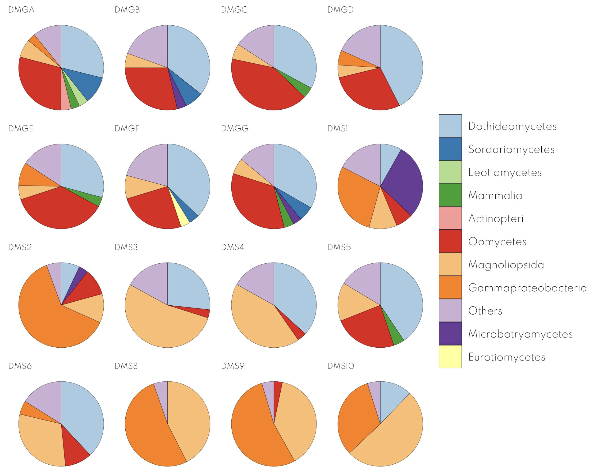{width=700}
:::
::: {.column width="60%" .f25}
*   **What it is:**  
    * A fast and accurate tool for assigning taxonomic labels to sequencing reads.
*   **Why is it useful for RNA-Seq?**
    *   RNA-Seq data can sometimes contain reads from microbial organisms (e.g., in microbiome studies, host-associated samples).
    *   Kraken2 can identify and classify these microbial reads, providing insights into the microbial community present in the sample.
*   **How it works:**
    *   Assigns taxonomic classifications to reads based on the best match.
*   **Benefits:**
    *   Fast and efficient classification.
    *   Accurate identification of microbial species.
    *   Can be used with both DNA and RNA sequencing data.
:::
:::: 

::::{.notes}
::: {style="font-size: 9pt"}
**Obiettivo:** Spiegare quando e perché usare Kraken2 in un esperimento RNA-seq.

- **Kraken2** assegna ogni read a un organismo tramite un database di k-meri: è estremamente rapido (processa milioni di reads al minuto) e accurato per la classificazione tassonomica
- In RNA-seq è utile per **rilevare contaminazione biologica**: colture cellulari contaminate da micoplasma, campioni clinici con batteri commensali, o esperimenti host-pathogen dove si vuole separare las reads umane da quelle virali
- Se una frazione significativa delle reads (> 5-10%) si mappa su organismi non target, è un segnale che richiede investigazione prima di procedere all'analisi differenziale
- Per esperimenti standard su linee cellulari umane è uno step opzionale, ma costa poco computazionalmente e può rivelare problemi inaspettati
:::
::::

##  {background-image="images/back001.jpg" background-size="cover" background-opacity="0.1"}

[Downstream Analysis]{.subtit}

### Differential Expression:  Finding the Genes that Matter


::: f30
*   **What it is:**  
    * Identifying genes that are expressed at significantly different levels between two or more conditions (e.g., treated vs. control, healthy vs. diseased).
*   **Why is it important?**
    *   Uncover genes involved in specific biological processes or disease states.
    *   Identify potential biomarkers or therapeutic targets.
*   **Tools:**
    *   `DESeq2`:  A popular R package for differential expression analysis.
    *   `edgeR`:  Another widely used R package.
    *   `limma`:  A flexible package for linear modeling and differential expression analysis.


:::

::::{.notes}
::: {style="font-size: 9pt"}
**Obiettivo:** Contestualizzare l'analisi differenziale come obiettivo finale del workflow e anticipare il modulo R.

- L'**analisi differenziale** è lo scopo principale di quasi tutti gli esperimenti RNA-seq: vogliamo sapere quali geni cambiano di espressione tra condizioni diverse (trattato vs controllo, malato vs sano)
- **DESeq2** è lo strumento che useremo nel corso: è considerato lo standard attuale per dati di conteggio RNA-seq, incorpora modelli statistici robusti per la normalizzazione e il test di significatività
- Tenete a mente che l'analisi differenziale richiede i **raw counts** (conteggi non normalizzati): è per questo che Salmon produce NumReads nel quant.sf oltre al TPM
- DESeq2, edgeR e limma producono risultati simili con dati di buona qualità; le differenze emergono con pochi replicati o campioni con alta varianza
:::
::::


##  {background-image="images/back001.jpg" background-size="cover" background-opacity="0.1"}

[Downstream Analysis]{.subtit}

### [MultiQC](https://seqera.io/examples/rna-seq/multiqc_report.html):  Your One-Stop Shop for QC Reports

::: f25
*   **What it is:**  A tool that aggregates results from multiple bioinformatics tools into a single HTML report.
*   **Why is it useful for RNA-Seq?**
    *   RNA-Seq analysis involves multiple QC steps (FastQC, SortMeRNA, Trim Galore!, etc.).
    *   MultiQC combines the results from these tools into a user-friendly report.
    *   This saves time and simplifies the QC assessment process.
*   **Key features:**
    *   Supports a wide range of bioinformatics tools.
    *   Generates interactive plots and tables for easy visualization.
    *   Highlights potential issues and inconsistencies in the data.
    *   Facilitates comparison of QC metrics across multiple samples.
*   **Benefits:**
    *   Saves time and effort in QC assessment.
    *   Improves clarity and organization of QC results.
    *   Facilitates data interpretation and decision-making.
:::

::::{.notes}
::: {style="font-size: 9pt"}
**Obiettivo:** Presentare MultiQC come strumento che aggrega tutti i report QC della pipeline in un unico documento navigabile.

- **MultiQC** legge automaticamente gli output di FastQC, fastp, STAR, Salmon, RSeQC, Qualimap, Picard e decine di altri tool: un solo report HTML per valutare l'intera corsa di sequenziamento
- Con 10, 20 o 50 campioni, aprire report individuali è impraticabile: MultiQC permette di confrontare tutti i campioni in un colpo d'occhio e identificare outlier immediatamente
- La sezione **General Statistics** all'inizio del report è il punto di partenza: tasso di mapping, reads totali, percentuale di duplicati e rRNA residua per tutti i campioni in una tabella
- È buona pratica **generare e revisionare il report MultiQC** prima di procedere all'analisi differenziale: identifica problemi sistematici, campioni da escludere o asimmetrie tra gruppi sperimentali
:::
::::

##  {background-image="images/back001.jpg" background-size="cover" background-opacity="0.1"}

:::{.p-img-center}
{width=2000}
:::

::::{.notes}
::: {style="font-size: 9pt"}
Abbiamo completato il tour della pipeline nf-core/rnaseq. Questa immagine mostra l'intero workflow: da **FASTQ grezzi** a **conteggi quantificati** e **report di qualità completi**. Nel modulo successivo importeremo i risultati di Salmon in R per l'analisi differenziale con DESeq2.
:::
::::

#  {background-image="images/qmark.jpg" background-size="cover" background-opacity="0.7"}


::: {style="position: absolute; left: 980px; top: 450px;"}
[Domande?]{style="font-size: 130px; font-weight: bold; color: white"}
:::

::::{.notes}
::: {style="font-size: 9pt"}
Aprire la discussione. Possibili domande da stimolare: Quale parte della pipeline vi ha sorpreso di più? Avete già dati RNA-seq su cui vorreste applicare questo workflow? C'è qualche step che non era chiaro?
:::
::::

